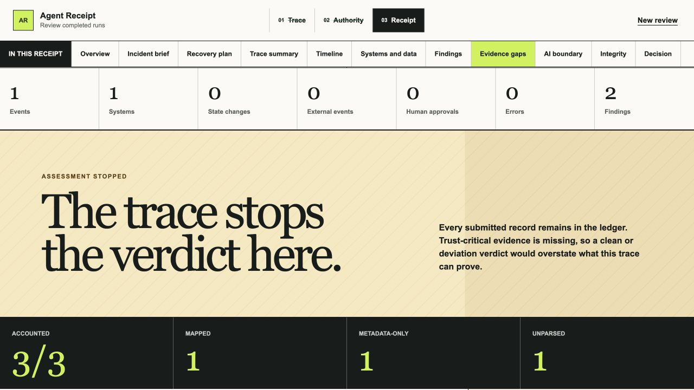

# Agent Receipt

Agent Receipt is a working post-run reviewer for agent logs. Upload or paste a completed JSON export, tell the app where its action records and fields live, declare what the agent was allowed to do, and receive an evidence-linked receipt.

It helps an AI operations manager answer one question quickly:

> Can I accept this run from the supplied evidence, or should I investigate or reject it?

The product rule is simple: deterministic rules establish what happened relative to authority; IBM Granite may explain the verified result, but it never decides the verdict.


The receipt puts the deterministic verdict, evidence scope, and manager attention queue first.

**Live app:** [receipt-one-flax.vercel.app](https://receipt-one-flax.vercel.app) · **Submission video:** [watch the 2:09 demo](https://drive.google.com/file/d/1a6-qbUImL2ZFOYaWq4reeaHr3TRfzV1U/view?usp=sharing) · **60-second judge path:** [judge guide](docs/JUDGE_GUIDE.md) · **Public repository:** [GitHub](https://github.com/mihirduvedi/agent-receipt) · **Full guide:** [project guide](docs/PROJECT_GUIDE.md) ([PDF](output/pdf/agent-receipt-complete-project-guide.pdf))

## Submission video

[](https://drive.google.com/file/d/1a6-qbUImL2ZFOYaWq4reeaHr3TRfzV1U/view?usp=sharing)

[Watch the 2:09 submission video in the public Google Drive player](https://drive.google.com/file/d/1a6-qbUImL2ZFOYaWq4reeaHr3TRfzV1U/view?usp=sharing) for the complete problem, product workflow, evidence boundary, and IBM Bob/Granite story. A [repository video copy](docs/media/agent-receipt-submission-video.mp4) and [English captions](docs/media/agent-receipt-submission-video.en.srt) are retained as download fallbacks.

## Bring your own agent log

The files bundled with the site are demonstration and regression fixtures. They make the public walkthrough repeatable, but they are not the only inputs the product can review. The deployed app accepts a JSON export from another agent or workflow through **Upload JSON** or **Paste JSON**.

For an unfamiliar record-oriented file, the live workflow is:

1. Upload or paste one UTF-8 JSON document up to 2 MiB.
2. Choose the root or nested array that contains the action records. Agent Receipt searches candidate arrays up to four object levels deep.
3. Confirm JSON Pointer paths for fields such as timestamp, operation, outcome, actor, and state change.
4. Translate the exporter’s observed values into the receipt vocabulary. Optional system, boundary, data-category, quantity, and approval fields can be mapped when the log records them.
5. Check the deterministic preview. Every selected record must be mapped or shown as material-unparsed before the authority review begins.
6. Declare the systems, operations, data rules, egress, volume, and approvals that applied to the run, then build the receipt.

The mapping is explicit because field names alone do not establish meaning. Agent Receipt never asks Granite to guess whether `op: "dispatch"` means a send, whether `ok: 1` means success, or whether a destination is external. The confirmed mapping manifest is validated, versioned, and retained with the receipt.

| Input | Live behavior |
|---|---|
| Agent Receipt Native Trace v1 | Opens directly in authority review |
| Documented OTLP/JSON GenAI profile | Uses the built-in narrow adapter |
| Root or nested array of JSON action records | Opens the explicit mapping workflow |
| JSONL, YAML, archives, binary telemetry, remote URLs, or mixed multi-run bundles | Requires conversion or a format-specific adapter first |

A custom log still needs enough explicit facts to support a review. If required meanings are missing or ambiguous, those records remain unparsed and the product reports that the run cannot be assessed fully. That is a deliberate evidence boundary, not silent parser failure. See the [generic JSON adapter guide](docs/GENERIC_JSON_ADAPTER.md) for the complete contract and a reproducible ten-record example.

## What the product does

- Preserves the exact source bytes and computes their SHA-256 before normalization.
- Accepts live user-uploaded or pasted JSON record arrays through a reviewer-confirmed field and value mapping, then retains that manifest with the receipt.
- Accounts for every raw event as mapped, metadata-only, or unparsed.
- Stops the assessment when material evidence is missing, shows why, and opens retained raw-only records that have no canonical event.
- Compares observed actions with declared systems, operations, data restrictions, egress rules, volume limits, and approvals.
- Produces a deterministic verdict, findings, coverage record, and integrity metadata.
- Records every manager-facing policy check as deviation found, no finding, unable to assess, or not active, with links to the evaluated evidence.
- Groups related findings into a concise incident brief without hiding the detailed findings.
- Proposes cited, reversible recovery steps for human approval; it never executes remediation.
- Summarizes every canonical action in plain language, including systems and data referenced, work completed or attempted, and carefully qualified “no observed activity” statements.
- Opens every material conclusion into its canonical event and retained raw JSON object.
- Keeps the human accept/investigate/reject disposition separate from the product verdict.
- Exports a schema-validated receipt as JSON.
- Exports a versioned recovery plan whose citations close over retained receipt evidence and whose SHA-256 binds it to the exact receipt under review.
- Packages a manager decision brief, validated receipt, and citation-closed recovery plan into one strict Evidence Packet v1 file with an independently replayable three-artifact manifest.
- Replays an exported receipt or evidence packet entirely in the browser: exact-file digest, strict contracts, artifact manifest, event accounting, deterministic policy result, cited copy, and recovery binding all have to agree.
- Shows the exact minimized, redacted fact bundle that Granite can receive, together with the fields held back and the deterministic gates around the model call.
- Remains usable without credentials or network inference through a deterministic fallback.

## Product tour

Screenshots below use the repository's synthetic fixtures so the walkthrough can be reproduced exactly. The upload and mapping screens run in the same deployed product path for a reviewer’s own JSON file.

### 1. Choose an exact trace


Upload Native Trace v1, supported OTLP/JSON, or another JSON record array, paste one document, or use a fixture for a quick demonstration. File bytes are preserved and hashed before parsing.

### 1A. Map an unfamiliar JSON log without guessing

If the JSON is not a built-in format, Agent Receipt finds candidate record arrays and opens an explicit mapping step in the live app. The reviewer confirms run facts, JSON Pointer field paths, and translations from observed operation, outcome, and state-change values into the canonical vocabulary. A deterministic preview shows mapped and material-unparsed counts before authority review. The mapping manifest is retained in the exported receipt; Granite never participates in ingestion. See the [generic JSON adapter contract](docs/GENERIC_JSON_ADAPTER.md).

### 2. Declare authority before judging the run


The manager confirms task, systems, operations, data restrictions, egress rule, volume limit, and approvals. Authority is never inferred from the observed actions. The overreaching run is then condensed into two related incidents with cited proposed recovery steps, while the full deterministic findings remain available.

### 3. Stop when the evidence cannot support a verdict



The incomplete OTLP sample accounts for all three source spans, then refuses to overclaim: one material action cannot be mapped and the trace does not establish run termination. The manager can inspect both gaps and every retained source record.

### 4. See fired and non-fired policy checks together

Open **Policy checks** to review the complete deterministic decision ledger. Every check names its authority field or behavior criterion, its outcome, and the supplied evidence evaluated. “No finding” means no deviation was produced from explicit supplied facts; it is not a completeness or compliance claim.

### 5. Triage incidents instead of rule hits


Related deterministic findings become a concise incident brief only when they cite the same events or share an explicit action key. The complete finding list remains available below.

### 6. Plan recovery without hiding execution risk


The receipt proposes cited follow-up steps with required authority and reversibility notes. A manager can download the plan as validated JSON bound to the exact receipt. The plan records that current external state is unknown, approval is required, and nothing was executed.

### 7. Translate every canonical action


The summary separates observed activity from carefully qualified no-observed-activity statements and keeps unknown facts visible.

### 8. Inspect systems and data movement


The boundary map highlights local, internal, external, and unknown destinations, with a full text-equivalent table for accessibility and exact evidence navigation.

### 9. Inspect the model boundary


The AI boundary panel rebuilds the same minimized, recursively redacted projection used by the server route. It shows whether Granite or fallback produced the receipt copy, which evidence IDs Granite may select, what is deliberately excluded, and the exact read-only JSON bundle.

### 10. Open a claim into retained evidence


Every material conclusion opens into its cited finding, canonical event, and retained raw JSON object.

### 11. Keep human disposition separate from the verdict


Accept, investigate, or reject records a manager decision without changing the deterministic verdict, findings, or evidence. The primary export is a single Evidence Packet v1 file containing the manager brief, validated receipt, and citation-closed recovery plan. The standalone receipt remains available. Neither export includes the retained raw input.

### 12. Replay the complete handoff

Switch to **Verify an export** to check either Receipt v1 or Evidence Packet v1 without a server, credentials, network request, or Granite call. For a packet, the verifier hashes the exact imported file, validates the cross-artifact contract, replays all three manifest digests, runs the complete receipt verifier, and confirms the proposal-only recovery plan is bound to the canonical receipt. Its limitations stay visible even when all eight packet gates pass.

For the fastest local proof, select **Verify evidence packet**, then reset and select **Catch altered sample**. The packet passes all eight gates; the changed receipt fails policy and citation replay. Existing `/?mode=verify&sample=valid` and `/?mode=verify&sample=altered` receipt shortcuts remain backward-compatible. See the [Evidence Packet contract](docs/PORTABLE_EVIDENCE_PACKET.md) and [standalone receipt-verifier contract](docs/PORTABLE_RECEIPT_VERIFIER.md).

## Try a custom JSON file locally

Requirements: Node.js 24 and npm 11.

```bash
npm ci
npm run dev
```

Open [http://localhost:3000](http://localhost:3000), then upload [`examples/codex-policy-ledger-release-generic-log.json`](examples/codex-policy-ledger-release-generic-log.json). It has a deliberately unrelated field structure and exercises the same mapping UI used for another exporter. Follow the companion [mapping recipe](docs/GENERIC_JSON_ADAPTER.md#test-the-example-in-the-ui) and confirm **Selected 10 · Mapped 10 · Unparsed 0** before building the receipt.

To use a different agent export, choose its action-record array and map the meanings documented by that exporter. Do not map a field based only on a plausible name. If the file does not contain explicit timestamps, operations, outcomes, actors, or state-change semantics, preprocess it into a clearer record array or add a dedicated adapter.

## Run the repeatable fixture demo locally

In the same local app:

1. Choose **Expected run**.
2. Review the preset authority and select **Build receipt**.
3. Open **Policy checks** and inspect the nine deterministic outcomes.
4. Read the verdict, plain-language action summary, coverage, and integrity record.
5. Open an evidence control to compare the canonical event with the retained raw object.
6. Start a new review with **Overreaching run**.
7. Inspect the six deviating and three non-firing policy checks, then the external spreadsheet attempt, successful retry, customer-email movement, and unapproved send.
8. Record a reviewer disposition and download the complete evidence packet. The standalone receipt and recovery-plan exports remain available.
9. Start a third review with **Incomplete OTLP run**.
10. Open **Evidence gaps**, then compare the explicit unable-to-assess check with the inactive authority constraints and inspect the raw-only source record.
11. Start a new review, select **Verify an export**, replay the valid evidence packet, then run the altered-receipt demonstration.

The samples are synthetic by design. They lock known verdicts and edge cases for judges and automated tests. The expected run contains three in-authority events. The overreaching run contains six events, including an unknown-outcome external write followed by a successful retry and an external message send. The incomplete OTLP run contains three source spans and demonstrates the third honest outcome: the supplied evidence is insufficient for a complete authority assessment. Custom uploads travel through the same exact-byte capture, accounting, policy, receipt, and export pipeline after adaptation.

## How it works

```text
exact trace bytes
      ↓ SHA-256 before normalization
native, narrow OTLP, or reviewer-mapped generic adapter → canonical events + raw-event accounting
      ↓
deterministic policy engine → findings + qualified verdict + policy decision ledger
      ↓
minimized, redacted fact bundle → server-only Granite route
      ↓ valid citations and schema, or deterministic fallback
evidence-linked receipt → human disposition → Portable Evidence Packet v1
                                      ↓            ├─ manager decision brief
                                      ↓            ├─ validated receipt
                                      └────────────└─ cited recovery plan
                                                   + three-artifact manifest
```

The browser retains the source snapshot for evidence drill-down. The server route recomputes the findings, then builds a minimized and redacted fact bundle for Granite. The receipt exposes that same projection in a read-only AI boundary panel so a judge or manager can inspect what the model may receive. Generated claims are schema-checked and rejected if their citations are invalid. Missing fields remain unknown; the model is never asked to fill them in.

## Hackathon fit

**Selected theme:** Wildcard — **Build Intelligent Systems for the Future of Work**. Agent Receipt supports human decision-making around AI coworkers by turning completed runs into reviewable, evidence-linked authority receipts.

| Judging criterion | Agent Receipt fit |
|---|---|
| Technical execution | A working strict-TypeScript prototype preserves exact input bytes, accounts for every raw event, records every manager-facing policy check, validates external boundaries with Zod, and replays a three-artifact evidence packet without a service dependency. |
| Innovation | Compares declared intent with observed action, makes fired, non-fired, unknown, and inactive checks inspectable, prevents generated prose from changing the verdict, and turns the manager handoff into a self-checking evidence contract. |
| Feasibility | Accepts live uploaded or pasted Native Trace v1, documented OTLP/JSON GenAI, and explicitly mapped record-oriented JSON; works locally without external services; exports one complete evidence packet; verifies receipts and packets offline; and isolates the optional watsonx.ai call behind one server route. |
| Challenge fit | Gives teams and AI operations managers decision support for reviewing work completed by AI collaborators, directly matching the future-of-work wildcard theme. |
| Real-world impact | Helps a manager decide whether to accept, investigate, or reject a completed run while showing where the supplied evidence cannot support any complete conclusion. |

The challenge page presents five judging lenses. The official rules score four headings by combining implementation and feasibility. This evidence map covers both formulations.

The challenge requires IBM Bob as the primary development tool, permits additional IBM AI technologies such as Granite, and asks for a working prototype, public repository, clear README, and public video.

## IBM AI roles

### IBM Bob: primary development tool

IBM Bob produced the trust-critical foundation, including the evidence schemas, native adapter, raw-event accounting, deterministic policy engine, initial Granite boundary, redaction, claim validation, fallback behavior, fixtures, and focused tests. Supporting tools were used for independent safety review, orchestration hardening, UI implementation, visual/accessibility QA, documentation, and later adapter/evaluation refinements, with no cross-attribution between tools. See the [public Bob build story](docs/BOB_BUILD_STORY.md).

### IBM Granite: bounded runtime explainer

Granite receives only a minimized, redacted, server-side fact bundle and returns a compact selection of notable finding IDs. The application validates those IDs, then deterministically renders the exact cited sentences. Timeout, credential, network, malformed-output, and invalid-selection failures fall back to deterministic copy without blocking the review flow.

Granite gives the prototype an IBM-native runtime explanation layer that fits the challenge ecosystem. The project has not benchmarked it against other models. The explainer is replaceable by design, and the release accepts only `granite` or `deterministic_fallback` generation provenance so another model cannot be silently relabeled as Granite.

## Trust boundary

| Layer | Deterministic? | Responsibility |
|---|---:|---|
| Exact-byte capture and digest | Yes | Preserve the supplied source and its reproducible hash |
| Adapter and event accounting | Yes | Normalize known fields and expose mapped, metadata-only, and unparsed counts |
| Generic JSON mapping manifest | Human + deterministic validation | Record reviewer-confirmed paths and value meanings; reject or expose anything that cannot map |
| Evidence Gap Mode | Yes | Stop unsupported conclusions and link gaps to canonical or raw-only source records |
| Policy findings and verdict | Yes | Reconcile observed actions with declared authority |
| Policy Decision Ledger | Yes | Record fired, non-fired, unable-to-assess, and inactive checks with citations to supplied evidence |
| Human action summary | Yes | Translate every canonical event without changing unknown outcomes |
| Granite copy | No | Explain only supplied, redacted facts with citations |
| Claim validation and fallback | Yes | Reject unsupported generated copy and keep the receipt usable |
| AI boundary view | Yes | Rebuild and disclose the minimized, redacted projection without exposing the retained raw trace |
| Portable Receipt Verifier | Yes | Hash the exact imported export and replay its schema, accounting, policy result, and citations entirely in the browser |
| Recovery-plan export | Yes | Bind cited proposed actions to the exact receipt without granting execution authority |
| Portable Evidence Packet v1 | Yes | Carry a manager brief, receipt, and recovery plan in one strict JSON handoff with three independently replayed manifest entries |
| Reviewer disposition | Human | Record accept, investigate, reject, or unreviewed without changing the verdict |

## Verification

Run the complete local gate:

```bash
npm run verify
```

Run the reproducible synthetic evaluation separately:

```bash
npm run eval
```

The full gate runs lint, strict TypeScript, the complete test suite, a production build, and a deterministic release audit (secrets, personal paths, dependency licenses, media attribution). The [evaluation report](docs/EVALUATION.md) records exact results and limitations. The [judge guide](docs/JUDGE_GUIDE.md) gives the shortest evidence path; remaining submission work is limited to team eligibility, the public video, and the final project page.

## Input contract

The MVP accepts one UTF-8 Agent Receipt Native Trace v1 document, one [narrow documented OTLP/JSON GenAI export](docs/OTLP_GENAI_ADAPTER.md), or one JSON document containing a reviewer-selected action-record array through the [explicit generic JSON adapter](docs/GENERIC_JSON_ADAPTER.md), up to 2 MiB by file upload or paste. The bundled samples enter through the same intake boundary. It rejects JSONL, archives, remote URLs, binary formats, documents without a non-empty record array, and multiple runs in one receipt.

## Test live Granite

The default experience requires no credentials. To test live watsonx.ai Granite instead of the deterministic fallback:

1. In your own IBM watsonx.ai account, get a project ID, regional base URL, and IAM API key (**Developer access** / **Administration → Access (IAM) → API keys**), and pick a provided, pay-per-token Granite model ID. As of August 2026, Dallas offers `ibm/granite-4-h-small`. Repository clones contain no shared credential: whoever enables live mode pays through the IBM account associated with the credentials they supply.
2. Copy `.env.example` to `.env.local` (already git-ignored) and set `GRANITE_MODE=live` plus `WATSONX_API_KEY`, `WATSONX_PROJECT_ID`, `WATSONX_URL`, and `WATSONX_MODEL_ID`. Keep these server-only — never add a `NEXT_PUBLIC_` prefix, and never commit or paste the key anywhere. Vercel production and preview deployments also require the deliberate `GRANITE_ALLOW_PUBLIC_LIVE=true` opt-in after live release checks.
3. Restart `npm run dev` and run a sample. A successful call shows **Granite explanation** in the verdict source line and `granite` as the integrity record's copy source. An unreachable or misconfigured endpoint uses **Deterministic template** and keeps the review available.
4. `npm run test:run -- tests/unit/granite.test.ts tests/unit/generateReceiptCopy.test.ts` covers the boundary's safety contracts without needing live credentials.

The server uses watsonx.ai's Chat API. The older text-generation endpoint is deprecated, and withdrawn Granite model IDs should not be reused from older setup notes.

For deployment, set the same five variables through the host's encrypted environment settings. The app is fully usable without them, in deterministic fallback mode. Keep public live mode disabled unless the host also enforces request throttling and spend limits: this six-day MVP intentionally has no accounts or durable rate limiter, so a publicly enabled model route could otherwise be used by any visitor.

## Deployment

The live demo runs on [Vercel](https://vercel.com/docs/plans/hobby) on the free Hobby plan. The app's `POST /api/receipt-copy` route needs a Node.js-capable host to keep the Granite boundary server-only; a static host such as GitHub Pages cannot serve that route.

## GitHub Codespaces

The committed `.devcontainer/devcontainer.json` provisions Node.js 24 and forwards port 3000. Select **Code → Codespaces → Create codespace on main**, wait for `npm ci`, then run `npm run dev`. IBM Bob IDE is a standalone app, not a Codespaces extension — see [docs/IBM_BOB_WORKFLOW.md](docs/IBM_BOB_WORKFLOW.md) to use Bob against the same repository.

## Challenge and project documents

This MVP targets the IBM SkillsBuild AI Builders Challenge with IBM Bob, Wildcard track. The recorded deadline is August 31, 2026 at 11:59 PM ET / 8:59 PM PT. Live rules can change; recheck the [challenge page](https://aibuilderschallenge-bob.bemyapp.com/), [submission platform](https://aibuilderschallenge-bobhub.bemyapp.com/), and [official rules](https://res.cloudinary.com/ideation/image/upload/q_100,f_pdf,dpr_auto/id-ibm-skillsbuil-3eec69/pkqvg8j3q3a4teedy1kd.pdf) before submission.

- [Product requirements](docs/PRD.md)
- [60-second judge guide](docs/JUDGE_GUIDE.md)
- [IBM Bob and supporting-tools workflow](docs/IBM_BOB_WORKFLOW.md)
- [IBM Bob build evidence](docs/BOB_BUILD_STORY.md)
- [Reproducible evaluation](docs/EVALUATION.md)
- [Portable Receipt Verifier contract](docs/PORTABLE_RECEIPT_VERIFIER.md)
- [Portable Evidence Packet v1 contract](docs/PORTABLE_EVIDENCE_PACKET.md)
- [Policy Decision Ledger contract](docs/POLICY_DECISION_LEDGER.md)
- [Recovery Plan v1 contract](docs/RECOVERY_PLAN.md)
- [Paste-ready submission copy](docs/SUBMISSION.md)
- [Three-minute judge demo script](docs/DEMO_SCRIPT.md)
- [Narrow OTLP/JSON adapter contract](docs/OTLP_GENAI_ADAPTER.md)
- [Explicit generic JSON adapter contract](docs/GENERIC_JSON_ADAPTER.md)

## Limits

Agent Receipt is a post-run review aid, not live interception, enforcement, legal compliance certification, trusted capture, a tamper-proof log, or access to private chain-of-thought. The generic adapter broadens structure, not evidence: it cannot recover fields an exporter omitted or prove the selected record array captured every action. “No observed activity” means no supplied event referenced an item; it does not prove real-world inactivity outside the trace. A ledger status of “No finding” means the corresponding deterministic check produced no deviation from explicit supplied facts; it does not prove trace completeness, safety, or compliance. Every conclusion applies only to the supplied trace and authority envelope.

## License

Agent Receipt is proprietary, not open source. Authorized hosted users may use the product's functionality, while source access is limited to narrow, unmodified evaluation. Copying, modifying, redistributing, commercializing, training on, or using the code to build a competing or replicated product is prohibited without prior written permission. See [LICENSE](LICENSE) for the complete terms. Third-party dependencies retain their own licenses.
