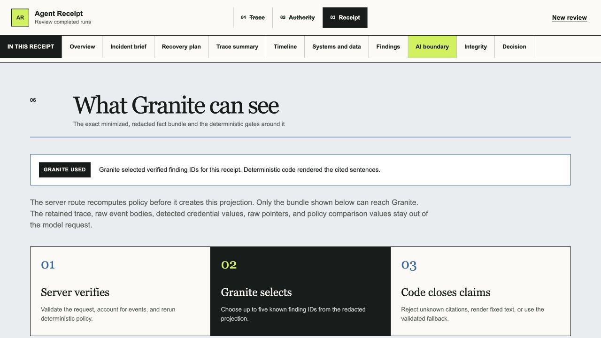

# Agent Receipt

Agent Receipt turns a completed AI-agent trace and a manager-declared authority envelope into an evidence-linked review receipt. It helps an AI operations manager answer one question quickly:

> Can I accept this run from the supplied evidence, or should I investigate or reject it?

The product rule is simple: deterministic rules establish what happened relative to authority; IBM Granite may explain the verified result, but it never decides the verdict.


The receipt puts the deterministic verdict, evidence scope, and manager attention queue first.

**Live demo:** [receipt-one-flax.vercel.app](https://receipt-one-flax.vercel.app) · **60-second judge path:** [judge guide](docs/JUDGE_GUIDE.md) · **Public repository:** [GitHub](https://github.com/mihirduvedi/agent-receipt) · **Full guide:** [project guide](docs/PROJECT_GUIDE.md) ([PDF](output/pdf/agent-receipt-complete-project-guide.pdf))

## What the prototype does

- Preserves the exact source bytes and computes their SHA-256 before normalization.
- Accounts for every raw event as mapped, metadata-only, or unparsed.
- Compares observed actions with declared systems, operations, data restrictions, egress rules, volume limits, and approvals.
- Produces a deterministic verdict, findings, coverage record, and integrity metadata.
- Groups related findings into a concise incident brief without hiding the detailed findings.
- Proposes cited, reversible recovery steps for human approval; it never executes remediation.
- Summarizes every canonical action in plain language, including systems and data referenced, work completed or attempted, and carefully qualified “no observed activity” statements.
- Opens every material conclusion into its canonical event and retained raw JSON object.
- Keeps the human accept/investigate/reject disposition separate from the product verdict.
- Exports a schema-validated receipt as JSON.
- Exports a versioned recovery plan whose citations close over retained receipt evidence and whose SHA-256 binds it to the exact receipt under review.
- Shows the exact minimized, redacted fact bundle that Granite can receive, together with the fields held back and the deterministic gates around the model call.
- Remains usable without credentials or network inference through a deterministic fallback.

## Product tour

Screenshots below come from the production build using the repository's synthetic overreaching fixture.

### 1. Choose an exact trace


Start from a synthetic fixture, upload one Native Trace v1 or supported OTLP/JSON document, or paste one document. File bytes are preserved and hashed before parsing.

### 2. Declare authority before judging the run


The manager confirms task, systems, operations, data restrictions, egress rule, volume limit, and approvals. Authority is never inferred from the observed actions. The overreaching run is then condensed into two related incidents with cited proposed recovery steps, while the full deterministic findings remain available.

### 3. Triage incidents instead of rule hits


Related deterministic findings become a concise incident brief only when they cite the same events or share an explicit action key. The complete finding list remains available below.

### 4. Plan recovery without hiding execution risk


The receipt proposes cited follow-up steps with required authority and reversibility notes. A manager can download the plan as validated JSON bound to the exact receipt. The plan records that current external state is unknown, approval is required, and nothing was executed.

### 5. Translate every canonical action


The summary separates observed activity from carefully qualified no-observed-activity statements and keeps unknown facts visible.

### 6. Inspect systems and data movement


The boundary map highlights local, internal, external, and unknown destinations, with a full text-equivalent table for accessibility and exact evidence navigation.

### 7. See the model boundary, not just a model badge



The AI boundary panel rebuilds the same minimized, recursively redacted projection used by the server route. It shows whether Granite or fallback produced the receipt copy, which evidence IDs Granite may select, what is deliberately excluded, and the exact read-only JSON bundle.

### 8. Open a claim into retained evidence


Every material conclusion opens into its cited finding, canonical event, and retained raw JSON object.

### 9. Keep human disposition separate from the verdict


Accept, investigate, or reject records a manager decision without changing the deterministic verdict, findings, or evidence. The receipt then exports as validated JSON without the retained raw input.

## Run the demo locally

Requirements: Node.js 24 and npm 11.

```bash
npm ci
npm run dev
```

Open [http://localhost:3000](http://localhost:3000), then:

1. Choose **Expected run**.
2. Review the preset authority and select **Build receipt**.
3. Read the verdict, plain-language action summary, coverage, and integrity record.
4. Open an evidence control to compare the canonical event with the retained raw object.
5. Start a new review with **Overreaching run**.
6. Inspect the external spreadsheet attempt, successful retry, customer-email movement, and unapproved send.
7. Record a reviewer disposition, download the receipt JSON, and export the citation-closed recovery plan.

The samples are synthetic. The expected run contains three in-authority events. The overreaching run contains six events, including an unknown-outcome external write followed by a successful retry and an external message send.

## How it works

```text
exact trace bytes
      ↓ SHA-256 before normalization
versioned native or narrow OTLP adapter → canonical events + raw-event accounting
      ↓
deterministic policy engine → findings + qualified verdict
      ↓
minimized, redacted fact bundle → server-only Granite route
      ↓ valid citations and schema, or deterministic fallback
evidence-linked receipt → human disposition → validated receipt JSON
                                      ↓
                         cited recovery-plan JSON
                         bound to the receipt digest
```

The browser retains the source snapshot for evidence drill-down. The server route recomputes the findings, then builds a minimized and redacted fact bundle for Granite. The receipt exposes that same projection in a read-only AI boundary panel so a judge or manager can inspect what the model may receive. Generated claims are schema-checked and rejected if their citations are invalid. Missing fields remain unknown; the model is never asked to fill them in.

## Hackathon fit

**Selected theme:** Wildcard — **Build Intelligent Systems for the Future of Work**. Agent Receipt supports human decision-making around AI coworkers by turning completed runs into reviewable, evidence-linked authority receipts.

| Judging criterion | Agent Receipt fit |
|---|---|
| Technical execution | A working strict-TypeScript prototype preserves exact input bytes, accounts for every raw event, runs deterministic policy rules, validates external boundaries with Zod, and keeps a credential-free fallback usable. |
| Innovation | Compares declared intent with observed action; generated prose cannot change the verdict and must cite retained evidence. |
| Feasibility | Accepts bounded Native Trace v1 and documented OTLP/JSON GenAI contracts, works locally without external services, exports a validated receipt and recovery plan, and isolates the optional watsonx.ai call behind one server route. |
| Challenge fit | Gives teams and AI operations managers decision support for reviewing work completed by AI collaborators, directly matching the future-of-work wildcard theme. |
| Real-world impact | Helps a manager decide whether to accept, investigate, or reject a completed run while preserving unknowns and the limits of the supplied evidence. |

The challenge page presents five judging lenses. The official rules score four headings by combining implementation and feasibility. This evidence map covers both formulations.

The challenge requires IBM Bob as the primary development tool, permits additional IBM AI technologies such as Granite, and asks for a working prototype, public repository, clear README, and public video.

## IBM AI roles

### IBM Bob: primary development tool

IBM Bob produced the trust-critical foundation, including the evidence schemas, native adapter, raw-event accounting, deterministic policy engine, initial Granite boundary, redaction, claim validation, fallback behavior, fixtures, and focused tests. Supporting tools were used for independent safety review, orchestration hardening, UI implementation, visual/accessibility QA, documentation, and later adapter/evaluation refinements, with no cross-attribution between tools. See the [public Bob build story](docs/BOB_BUILD_STORY.md).

### IBM Granite: bounded runtime explainer

Granite receives only a minimized, redacted, server-side fact bundle and returns a compact selection of notable finding IDs. The application validates those IDs, then deterministically renders the exact cited sentences. Timeout, credential, network, malformed-output, and invalid-selection failures fall back to deterministic copy without blocking the review flow.

Granite gives the prototype an IBM-native runtime explanation layer that fits the challenge ecosystem. The project has not benchmarked it against other models. The explainer is replaceable by design, and the release accepts only `granite` or `deterministic_fallback` generation provenance so another model cannot be silently relabeled as Granite.

## Trust boundary

| Layer | Deterministic? | Responsibility |
|---|---:|---|
| Exact-byte capture and digest | Yes | Preserve the supplied source and its reproducible hash |
| Adapter and event accounting | Yes | Normalize known fields and expose mapped, metadata-only, and unparsed counts |
| Policy findings and verdict | Yes | Reconcile observed actions with declared authority |
| Human action summary | Yes | Translate every canonical event without changing unknown outcomes |
| Granite copy | No | Explain only supplied, redacted facts with citations |
| Claim validation and fallback | Yes | Reject unsupported generated copy and keep the receipt usable |
| AI boundary view | Yes | Rebuild and disclose the minimized, redacted projection without exposing the retained raw trace |
| Recovery-plan export | Yes | Bind cited proposed actions to the exact receipt without granting execution authority |
| Reviewer disposition | Human | Record accept, investigate, reject, or unreviewed without changing the verdict |

## Verification

Run the complete local gate:

```bash
npm run verify
```

Run the reproducible synthetic evaluation separately:

```bash
npm run eval
```

The full gate runs lint, strict TypeScript, the complete test suite, a production build, and a deterministic release audit (secrets, personal paths, dependency licenses, media attribution). The [evaluation report](docs/EVALUATION.md) records exact results and limitations. The [judge guide](docs/JUDGE_GUIDE.md) gives the shortest evidence path; remaining submission work is limited to team eligibility, the public video, and the final project page.

## Input contract

The MVP accepts one UTF-8 Agent Receipt Native Trace v1 document or one [narrow documented OTLP/JSON GenAI export](docs/OTLP_GENAI_ADAPTER.md) up to 2 MiB, via sample selection, file upload, or paste. It rejects JSONL, archives, remote URLs, binary formats, unsupported schemas, and multiple runs or traces in one file.

## Test live Granite

The default experience requires no credentials. To test live watsonx.ai Granite instead of the deterministic fallback:

1. In IBM watsonx.ai, get a project ID, regional base URL, and IAM API key (**Developer access** / **Administration → Access (IAM) → API keys**), and pick a provided, pay-per-token Granite model ID. As of August 2026, Dallas offers `ibm/granite-4-h-small`.
2. Copy `.env.example` to `.env.local` (already git-ignored) and set `GRANITE_MODE=live` plus `WATSONX_API_KEY`, `WATSONX_PROJECT_ID`, `WATSONX_URL`, and `WATSONX_MODEL_ID`. Keep these server-only — never add a `NEXT_PUBLIC_` prefix, and never commit or paste the key anywhere. A public production deployment also requires the deliberate `GRANITE_ALLOW_PUBLIC_LIVE=true` opt-in after live release checks.
3. Restart `npm run dev` and run a sample. A successful call shows **Granite explanation** in the verdict source line and `granite` as the integrity record's copy source. An unreachable or misconfigured endpoint uses **Deterministic template** and keeps the review available.
4. `npm run test:run -- tests/unit/granite.test.ts tests/unit/generateReceiptCopy.test.ts` covers the boundary's safety contracts without needing live credentials.

The server uses watsonx.ai's Chat API. The older text-generation endpoint is deprecated, and withdrawn Granite model IDs should not be reused from older setup notes.

For deployment, set the same five variables through the host's encrypted environment settings. The app is fully usable without them, in deterministic fallback mode.

## Deployment

The live demo runs on [Vercel](https://vercel.com/docs/plans/hobby) on the free Hobby plan. The app's `POST /api/receipt-copy` route needs a Node.js-capable host to keep the Granite boundary server-only; a static host such as GitHub Pages cannot serve that route.

## GitHub Codespaces

The committed `.devcontainer/devcontainer.json` provisions Node.js 24 and forwards port 3000. Select **Code → Codespaces → Create codespace on main**, wait for `npm ci`, then run `npm run dev`. IBM Bob IDE is a standalone app, not a Codespaces extension — see [docs/IBM_BOB_WORKFLOW.md](docs/IBM_BOB_WORKFLOW.md) to use Bob against the same repository.

## Challenge and project documents

This MVP targets the IBM SkillsBuild AI Builders Challenge with IBM Bob, Wildcard track. The recorded deadline is August 31, 2026 at 11:59 PM ET / 8:59 PM PT. Live rules can change; recheck the [challenge page](https://aibuilderschallenge-bob.bemyapp.com/), [submission platform](https://aibuilderschallenge-bobhub.bemyapp.com/), and [official rules](https://res.cloudinary.com/ideation/image/upload/q_100,f_pdf,dpr_auto/id-ibm-skillsbuil-3eec69/pkqvg8j3q3a4teedy1kd.pdf) before submission.

- [Product requirements](docs/PRD.md)
- [60-second judge guide](docs/JUDGE_GUIDE.md)
- [IBM Bob and supporting-tools workflow](docs/IBM_BOB_WORKFLOW.md)
- [IBM Bob build evidence](docs/BOB_BUILD_STORY.md)
- [Reproducible evaluation](docs/EVALUATION.md)
- [Recovery Plan v1 contract](docs/RECOVERY_PLAN.md)
- [Paste-ready submission copy](docs/SUBMISSION.md)
- [Three-minute judge demo script](docs/DEMO_SCRIPT.md)
- [Narrow OTLP/JSON adapter contract](docs/OTLP_GENAI_ADAPTER.md)

## Limits

Agent Receipt is a post-run review aid, not live interception, enforcement, legal compliance certification, trusted capture, a tamper-proof log, or access to private chain-of-thought. “No observed activity” means no supplied event referenced an item; it does not prove real-world inactivity outside the trace. Every conclusion applies only to the supplied trace and authority envelope.

## License

Agent Receipt is proprietary, not open source. Authorized hosted users may use the product's functionality, while source access is limited to narrow, unmodified evaluation. Copying, modifying, redistributing, commercializing, training on, or using the code to build a competing or replicated product is prohibited without prior written permission. See [LICENSE](LICENSE) for the complete terms. Third-party dependencies retain their own licenses.
