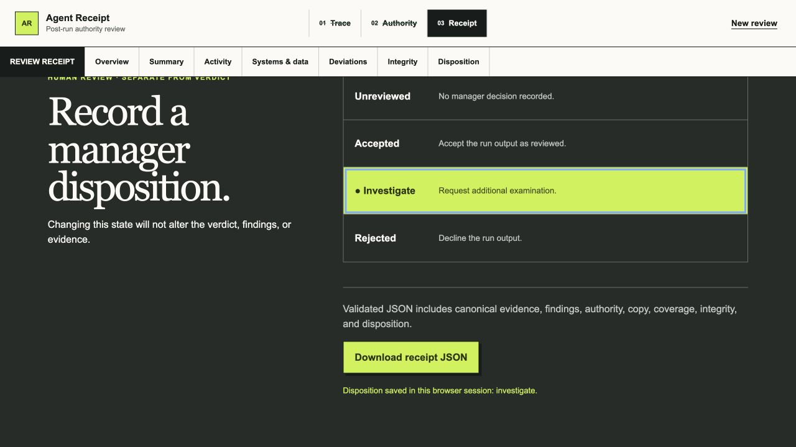

# Agent Receipt

Agent Receipt turns a completed AI-agent trace and a manager-declared authority envelope into an evidence-linked review receipt. It helps an AI operations manager answer one question quickly:

> Can I accept this run from the supplied evidence, or should I investigate or reject it?

The product rule is simple: deterministic rules establish what happened relative to authority; IBM Granite may explain the verified result, but it never decides the verdict.


The receipt puts the deterministic verdict, evidence scope, and manager attention queue first.

## What the prototype does

- Preserves the exact uploaded bytes and computes their SHA-256 before normalization.
- Accounts for every raw event as mapped, metadata-only, or unparsed.
- Compares observed actions with declared systems, operations, data restrictions, egress rules, volume limits, and approvals.
- Produces a deterministic verdict, findings, coverage record, and integrity metadata.
- Summarizes every canonical action in plain language, including systems and data referenced, work completed or attempted, and carefully qualified “no observed activity” statements.
- Opens every material conclusion into its canonical event and retained raw JSON object.
- Keeps the human accept/investigate/reject disposition separate from the product verdict.
- Exports a schema-validated receipt as JSON.
- Remains usable without credentials or network inference through a deterministic fallback.

## Product tour

All screenshots below come from the production build and use only the repository's synthetic overreaching fixture.

### 1. Choose an exact trace


Start from a synthetic fixture, upload one Native Trace v1 JSON file, or paste one document. File bytes are preserved and hashed before parsing.

### 2. Declare authority before judging the run


The manager confirms the task, systems, operations, data restrictions, egress rule, volume limit, and approval requirements. Authority is never inferred from the observed actions.

### 3. Translate every canonical action


The summary separates observed activity from carefully qualified no-observed-activity statements and keeps unknown facts visible.

### 4. Inspect systems and data movement


The boundary map highlights local, internal, external, and unknown destinations. A complete text-equivalent table follows it for accessibility and exact evidence navigation.

### 5. Open a claim into retained evidence


Every material conclusion can open into its cited finding, canonical event, and retained raw JSON object.

### 6. Keep human disposition separate from the verdict



Accept, investigate, or reject records a manager decision without changing the deterministic verdict, findings, or evidence. The validated receipt can then be exported as JSON without the retained raw input.

## Run the demo locally

Requirements: Node.js 24 and npm 11.

```bash
npm ci
npm run dev
```

Open [http://localhost:3000](http://localhost:3000), then:

1. Choose **Expected run**.
2. Review the preset authority and select **Analyze against authority**.
3. Read the verdict, plain-language action summary, coverage, and integrity record.
4. Open an evidence control to compare the canonical event with the retained raw object.
5. Start a new review with **Overreaching run**.
6. Inspect the external spreadsheet attempt, successful retry, customer-email movement, and unapproved send.
7. Record a reviewer disposition and download the receipt JSON.

The samples are synthetic. The expected run contains three in-authority events. The overreaching run contains six events, including an unknown-outcome external write followed by a successful retry and an external message send.

## How it works

```text
exact trace bytes
      ↓ SHA-256 before normalization
versioned adapter → canonical events + raw-event accounting
      ↓
deterministic policy engine → findings + qualified verdict
      ↓
minimized, redacted fact bundle → server-only Granite route
      ↓ valid citations and schema, or deterministic fallback
evidence-linked receipt → human disposition → validated JSON export
```

The browser retains the source snapshot for evidence drill-down. Only minimized and redacted facts are eligible for the server-side Granite request. Generated claims are schema-checked and rejected if their event or finding citations are invalid. Missing fields remain unknown; the model is never asked to fill them in.

## Hackathon fit

**Selected theme:** Wildcard — **Build Intelligent Systems for the Future of Work**. Agent Receipt supports human decision-making around AI coworkers by turning completed runs into reviewable, evidence-linked authority receipts.

| Judging criterion | Agent Receipt fit |
|---|---|
| Technical execution | A working strict-TypeScript prototype preserves exact input bytes, accounts for every raw event, runs deterministic policy rules, validates external boundaries with Zod, and keeps a credential-free fallback usable. |
| Innovation | Reconciles declared intent with observed action instead of presenting another generic trace viewer; generated prose cannot change the verdict and must cite retained evidence. |
| Feasibility | Accepts a bounded Native Trace v1 contract, works locally without external services, exports a validated receipt, and isolates the optional watsonx.ai call behind one server route. |
| Challenge fit | Gives teams and AI operations managers decision support for reviewing work completed by AI collaborators, directly matching the future-of-work wildcard theme. |
| Real-world impact | Helps a manager decide whether to accept, investigate, or reject a completed run while preserving unknowns and the limits of the supplied evidence. |

The challenge requires IBM Bob as the primary development tool, permits additional IBM AI technologies such as Granite, and asks for a working prototype, public repository, clear README, and public video. The [AI assistance log](docs/AI_ASSISTANCE_LOG.md) records Bob and supporting-tool work without cross-attribution.

## IBM AI roles

### IBM Bob: primary development tool

IBM Bob produced substantive trust-critical implementation, including the evidence schemas, native adapter, raw-event accounting, deterministic policy engine, Granite boundary, redaction, claim validation, fallback behavior, fixtures, and focused tests. Supporting tools were used for independent safety review, orchestration hardening, UI implementation, visual/accessibility QA, and documentation. The repository records this division honestly in [docs/AI_ASSISTANCE_LOG.md](docs/AI_ASSISTANCE_LOG.md); work performed by another tool is not attributed to Bob.

### IBM Granite: bounded runtime explainer

Granite receives only a minimized, redacted, server-side fact bundle. It returns structured, cited copy. The application validates its schema, citations, finding-event relationships, supported facts, and prohibited assurance language before accepting the response. Timeout, credential, network, malformed-output, and citation failures fall back to deterministic copy without blocking the review flow.

Granite was selected because it gives the prototype an IBM-native runtime explanation layer that fits the challenge ecosystem and supports concise instruction-following text generation. This is an architecture choice, not a claim that Granite beat every alternative: the team has not run a head-to-head model benchmark, and the deterministic boundary intentionally keeps the explainer replaceable.

### Model and runtime portability

The current release accepts only `granite` or `deterministic_fallback` generation provenance. Supporting another provider therefore requires an explicit schema, client, provenance-label, and test change rather than silently relabeling another model as Granite.

Reasonable future adapters include:

- **Ollama on a reviewer-controlled machine:** run IBM Granite locally for a credential-free IBM path, or evaluate another instruction model behind Ollama's local API. Ollama is a model runtime, not a model itself. IBM publishes an [official Granite with Ollama guide](https://www.ibm.com/granite/docs/run/granite-with-ollama-linux).
- **Another OpenAI-compatible local or hosted runtime:** preserve the same minimized fact bundle and strict output validation while changing the transport and provenance.
- **Another hosted model API:** useful for comparison testing, but it adds a separate vendor, privacy, pricing, and hackathon-story decision.
- **Deterministic templates only:** already implemented and the strongest option for availability and reproducibility.

Ollama is a good local experiment, but a Vercel deployment cannot call a model running only on a developer laptop. A public Ollama-backed demo would need a separately hosted, authenticated, rate-limited inference service. For this hackathon, watsonx.ai Granite plus the deterministic fallback remains the clearest public-demo configuration.

## Trust boundary

| Layer | Deterministic? | Responsibility |
|---|---:|---|
| Exact-byte capture and digest | Yes | Preserve the supplied source and its reproducible hash |
| Adapter and event accounting | Yes | Normalize known fields and expose mapped, metadata-only, and unparsed counts |
| Policy findings and verdict | Yes | Reconcile observed actions with declared authority |
| Human action summary | Yes | Translate every canonical event without changing unknown outcomes |
| Granite copy | No | Explain only supplied, redacted facts with citations |
| Claim validation and fallback | Yes | Reject unsupported generated copy and keep the receipt usable |
| Reviewer disposition | Human | Record accept, investigate, reject, or unreviewed without changing the verdict |

## Verification

Run the complete local gate:

```bash
npm run verify
```

The latest local snapshot passes lint with zero warnings, strict TypeScript, 287 tests across 12 files, a production build, and the deterministic release audit. The audit checks tracked source and production-build text for high-signal secrets, personal paths, and personal email addresses; verifies dependency license metadata; and requires attribution for app-owned media. Strict UI static analysis reports zero errors and zero warnings. Rendered checks cover both synthetic fixture flows, evidence focus/close/restore behavior, explicit unknown outcomes, a complete text alternative for system movement, and 390 px, 1280 px, and 1440 px layouts without document-level overflow or browser-console errors.

These are local results, not proof of live Granite, deployed, signed-out, screen-reader, or cross-browser behavior. See the evidence and remaining gates in [docs/RELEASE_QA.md](docs/RELEASE_QA.md).

## Input contract

The MVP accepts one UTF-8 Agent Receipt Native Trace v1 JSON document up to 2 MiB through sample selection, file upload, or paste. It rejects JSONL, archives, remote URLs, binary formats, unsupported top-level schemas, and multiple runs in one file.

Duplicate JSON property names follow the platform’s `JSON.parse` behavior: the last value is retained. Inputs should not rely on duplicate names, and the committed fixtures contain none.

## Test live Granite step by step

The default experience requires no credentials. Complete the deterministic sample flow first, then add watsonx.ai locally. Never paste credentials into an issue, chat, screenshot, command literal, or tracked file.

1. Sign in to IBM watsonx.ai and open or create the project that will own the demo inference usage.
2. From that project, open **Navigation menu → Developer access**. Copy the project ID and regional base URL. The base URL should look like `https://us-south.ml.cloud.ibm.com`, with the region matching the project.
3. Open **Administration → Access (IAM) → API keys → Create**. Save the new key immediately in a password manager; IBM shows the secret only when it is created. If an existing key is listed but its value was not saved, create a replacement instead of trying to recover it.
4. In the watsonx.ai Resource hub or foundation-model list, choose an IBM Granite **instruct** model that is currently available for inference in the same account and region. Record its exact model ID. Do not assume a model ID from an old tutorial is still available.
5. Create the ignored local environment file without overwriting an existing one:

   ```bash
   test -e .env.local || cp .env.example .env.local
   ```

6. Edit `.env.local` locally and set the five values below. Keep every variable server-only; do not add a `NEXT_PUBLIC_` prefix.

   ```dotenv
   GRANITE_MODE=live
   WATSONX_API_KEY=your-local-secret
   WATSONX_PROJECT_ID=your-project-id
   WATSONX_URL=https://your-region.ml.cloud.ibm.com
   WATSONX_MODEL_ID=the-currently-available-granite-model-id
   ```

7. Check presence without printing any value:

   ```bash
   for name in GRANITE_MODE WATSONX_API_KEY WATSONX_PROJECT_ID WATSONX_URL WATSONX_MODEL_ID; do
     if rg -q "^${name}=.+$" .env.local; then
       printf '%s: set\n' "$name"
     else
       printf '%s: missing\n' "$name"
     fi
   done
   rg -q '^GRANITE_MODE=live$' .env.local && printf 'Granite mode: live\n'
   git check-ignore -v .env.local
   git status --short
   ```

   The first command must report all five as set. `git check-ignore` must identify `.env.local` as ignored, and `git status` must not list it.

8. Start a fresh server process so Next.js reads the new environment:

   ```bash
   npm run dev
   ```

9. Run **Expected run → Analyze against authority**. A successful accepted response shows **Granite explained** in the verdict source line. In **Integrity record**, `Copy source` is `granite` and the model ID/API version appear. Repeat with **Overreaching run** and open at least one evidence control.
10. If the receipt says **Deterministic fallback**, the review flow still passed safely, but live Granite was not accepted. Recheck the regional URL, project access, exact model availability, and API-key status. The current client uses IBM's legacy text-generation endpoint, which remains supported by some listed models; choose a model that explicitly supports text generation. Do not add credential logging to diagnose it.
11. Prove failure safety after one successful live run: stop the server, temporarily set `WATSONX_MODEL_ID=ibm/not-a-real-model`, restart, and confirm the same receipt completes with **Deterministic fallback**. Restore the valid model ID immediately afterward.
12. Run the mocked Granite boundary tests and the complete local gate. These verify the safety contracts but do not replace the live browser evidence from step 9.

   ```bash
   npm run test:run -- tests/unit/granite.test.ts tests/unit/generateReceiptCopy.test.ts
   npm run verify
   ```

For deployment, add the same five values through the host's encrypted environment-variable settings rather than committing `.env.local`. Deploying without them is also valid: the public demo remains fully usable in deterministic fallback mode.

| Variable | Purpose |
|---|---|
| `WATSONX_API_KEY` | Server-only IBM Cloud API key |
| `WATSONX_PROJECT_ID` | watsonx.ai project identifier |
| `WATSONX_URL` | Regional watsonx.ai service URL |
| `WATSONX_MODEL_ID` | Granite model verified as available to the team |
| `GRANITE_MODE` | `live` for watsonx.ai; `fallback` for deterministic copy |

## Deployment recommendation

Use Vercel for the hackathon release candidate. The current application includes a dynamic `POST /api/receipt-copy` Next.js route, so it needs a Node.js-capable host to preserve the server-only Granite boundary. Vercel supports the current [Node.js 24 requirement](https://vercel.com/docs/functions/runtimes/node-js/node-js-versions), Next.js functions, [server-side environment variables](https://vercel.com/docs/environment-variables), automatic HTTPS, and a shareable `*.vercel.app` address on its [free Hobby plan](https://vercel.com/docs/plans/hobby).

GitHub Pages is static hosting. A Pages deployment would require a separate [static-only Next.js build](https://nextjs.org/docs/app/guides/static-exports) that removes the POST route and uses deterministic browser-side copy only; it would not be the same live-Granite prototype. Maintaining that second deployment shape is not worth the additional release risk for this six-day MVP.

The Vercel Hobby plan is intended for personal and non-commercial projects. It is suitable for a small hackathon demonstration if the project fits those terms; move to a paid or different host before using the service commercially. No deployment has been performed yet.

## GitHub Codespaces

The committed `.devcontainer/devcontainer.json` provisions Node.js 24, installs dependencies with `npm ci`, forwards port 3000, and configures the editor for TypeScript, ESLint, Prettier, and Vitest.

After the repository is available on GitHub:

1. Select **Code → Codespaces → Create codespace on main**.
2. Wait for `npm ci` to finish.
3. Run `npm run dev`.
4. Open the forwarded port.

IBM Bob IDE is a standalone application, not a Codespaces extension. Use the same repository in Bob IDE or install Bob Shell in the Codespace terminal. See [docs/IBM_BOB_WORKFLOW.md](docs/IBM_BOB_WORKFLOW.md).

## Challenge and project documents

This MVP targets the IBM SkillsBuild AI Builders Challenge with IBM Bob, Wildcard track. The recorded deadline is August 31, 2026 at 11:59 PM ET / 8:59 PM PT. Live rules can change; recheck the [challenge page](https://aibuilderschallenge-bob.bemyapp.com/), [submission platform](https://aibuilderschallenge-bobhub.bemyapp.com/), and [official rules](https://res.cloudinary.com/ideation/image/upload/q_100,f_pdf,dpr_auto/id-ibm-skillsbuil-3eec69/pkqvg8j3q3a4teedy1kd.pdf) before submission.

- [Product requirements](docs/PRD.md)
- [Release QA ledger](docs/RELEASE_QA.md)
- [IBM Bob and supporting-tools workflow](docs/IBM_BOB_WORKFLOW.md)
- [AI assistance log](docs/AI_ASSISTANCE_LOG.md)

## Limits

Agent Receipt is a post-run review aid, not live interception, enforcement, legal compliance certification, trusted capture, a tamper-proof log, or access to private chain-of-thought. “No observed activity” means no supplied event referenced an item; it does not prove real-world inactivity outside the trace. Every conclusion applies only to the supplied trace and authority envelope.

## License

Agent Receipt is proprietary, not open source. Authorized hosted users may use the product's functionality, while source access is limited to narrow, unmodified evaluation. Copying, modifying, redistributing, commercializing, training on, or using the code to build a competing or replicated product is prohibited without prior written permission. See [LICENSE](LICENSE) for the complete terms. Third-party dependencies retain their own licenses.
