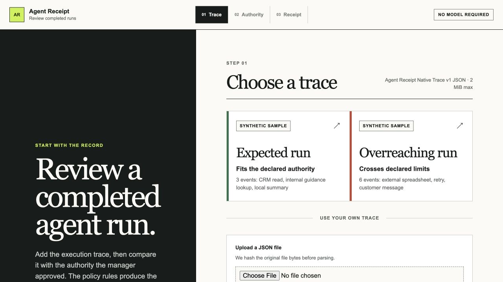
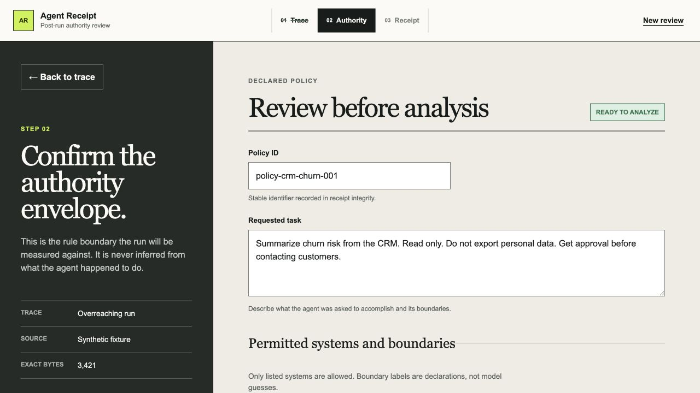
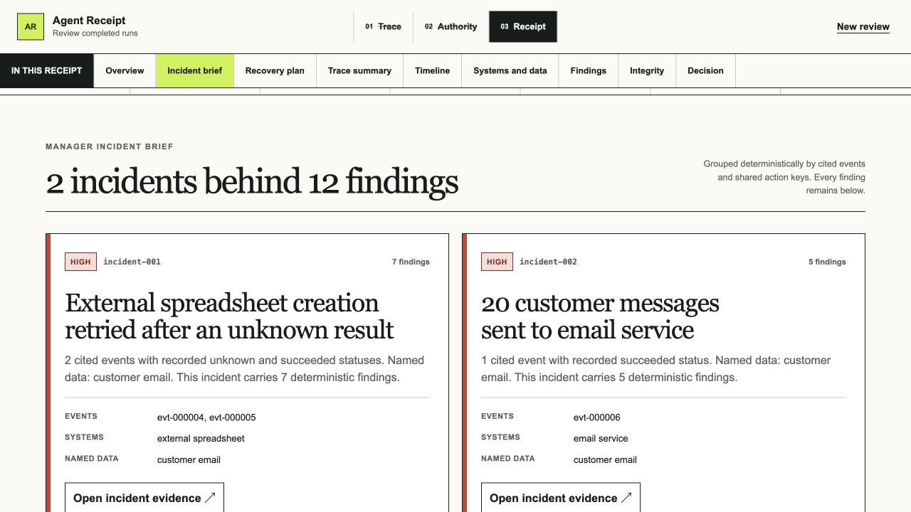
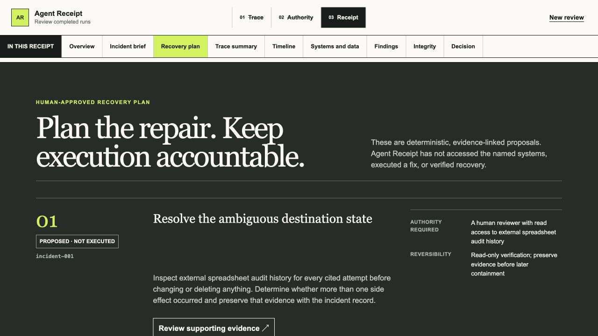
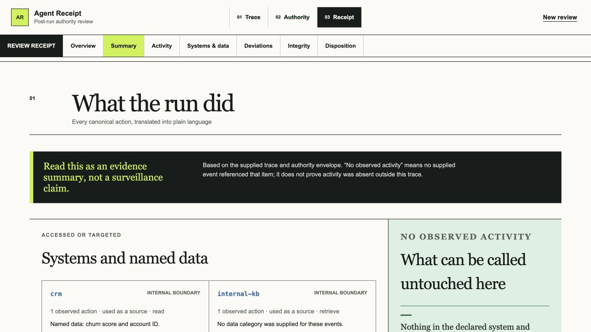
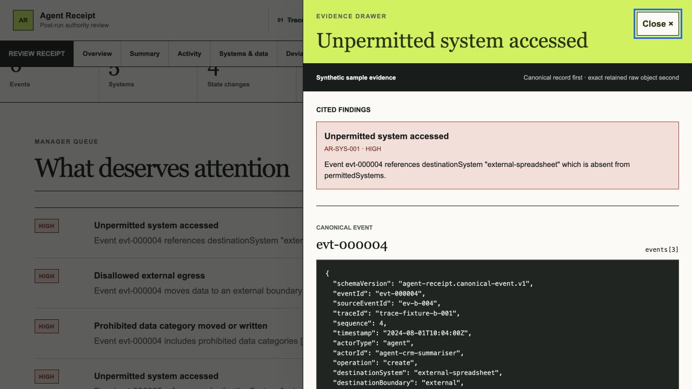
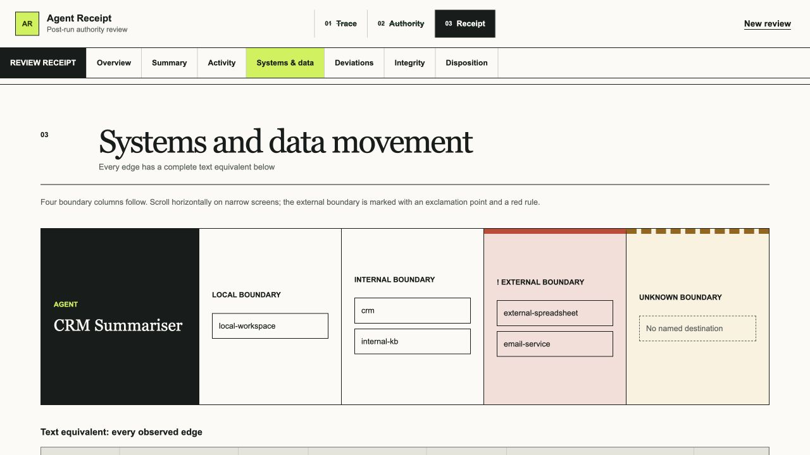

# Agent Receipt

## The complete project guide

**From first principles to architecture, code, trust boundaries, testing, and deployment**

Version 1.1 - August 28, 2026

Project snapshot: repository `main` and the successful Vercel deployment are connected to `0d3881fdb1f9304cb9d2c50298384283fca25560`. The local working candidate adds Recovery Plan v1 and the refreshed submission package described in this guide; those local changes are not yet committed, pushed, or deployed.

> Agent Receipt gives accountable humans an evidence-linked receipt for what an AI agent did relative to what it was allowed to do.


---

## How to use this guide

This guide is intentionally layered.

- If you have never studied computer science, begin with Parts I and II. They explain the product with a story, ordinary language, and small examples.
- If you understand basic programming, continue through Parts III and IV. They explain the TypeScript, Zod, React, Next.js, policy, and AI boundaries.
- If you want to run, test, review, or extend the project, use Parts V and VI plus the appendices.
- If you are comfortable with TypeScript or Python, the code explanations should feel familiar and occasionally use C++ comparisons. The guide still defines every project-specific term rather than assuming you already know distributed tracing, schema validation, or AI safety terminology.

You do not need to read every appendix in order. The main narrative tells the whole story; the appendices are a reference desk.

### Three labels used throughout

**Implemented and automatically verified** means the behavior exists in the current source and is covered by the local automated gate.

**Manually or externally verified** means a human or external service was used. That evidence is useful, but it is not the same as a unit test.

**Not yet verified** means the architecture may support something, but this project has not demonstrated it in that environment. The most important current example is live watsonx.ai Granite generation in the public Vercel deployment; local live generation has been verified separately.

---

# Part I - The idea, starting from zero

## 1. What problem does Agent Receipt solve?

Imagine you manage an AI assistant that can read customer records, create files, and send messages. You ask it to summarize which customers might leave. You give it clear limits:

- it may read the internal CRM;
- it may read the internal knowledge base;
- it may create a local summary;
- it may not export customer email addresses;
- it may not send messages without human approval.

The agent finishes and says, "Done."

That answer is not enough. A manager still needs to know:

1. What did the agent actually do?
2. Which systems did it touch?
3. Which data did it move?
4. Did it stay inside the authority it was given?
5. Is the evidence complete enough to trust the conclusion?
6. Can the manager inspect the exact record behind every important claim?

Most developer tracing tools answer a different question: "What calls happened, and how long did they take?" That is useful for debugging, but a timeline alone does not compare the run against the authority a human declared.

Agent Receipt is built around that comparison.

### The shortest possible explanation

Agent Receipt takes two inputs:

1. a trace, which is a structured record of the agent's observed actions; and
2. an authority envelope, which is a structured statement of what the agent was allowed to do.

It produces a receipt containing:

- normalized events;
- a record showing that every raw event was accounted for;
- deterministic findings;
- a deterministic verdict;
- plain-language, evidence-cited copy;
- integrity metadata;
- a separate human disposition;
- a validated receipt JSON export;
- a citation-closed recovery-plan JSON export bound to that receipt.

The word **deterministic** matters. It means the same validated evidence and authority produce the same policy result. An AI model does not decide whether a violation occurred.

## 2. Why call it a receipt?

A store receipt does not merely tell you that shopping happened. It itemizes what the transaction contained. You can compare it with what you intended to buy.

Agent Receipt applies the same mental model to an AI run:

| Store receipt idea | Agent Receipt equivalent |
|---|---|
| What you intended to buy | The authority envelope |
| Items actually recorded | Canonical events |
| Missing or unreadable line | Metadata-only or unparsed accounting |
| Unexpected charge | A deterministic finding |
| Total and transaction result | Coverage, integrity, and verdict |
| Customer accepts or disputes | Human disposition |

The analogy has limits. Agent Receipt does not prove that the supplied trace is a complete record of reality. It only evaluates the evidence it receives. That is why every verdict is qualified with:

> Based on the supplied trace and authority envelope.

## 3. The primary user and their one-minute job

The primary user is an **AI operations manager or team lead**. This person owns the outcome of a completed run but may not have watched every tool call live.

Their job is not to debug every line of code. Their job is to decide:

- **accept** the run output;
- **investigate** it further; or
- **reject** it.

The interface therefore places the manager-readable answer first:

1. deterministic verdict;
2. evidence qualifier and generation source;
3. count of items that deserve attention;
4. requested task and observed outcome;
5. high-level metrics;
6. exact evidence on demand.

Developers, security reviewers, and internal auditors are secondary users. They can drill into canonical events and retained raw JSON without forcing the manager to begin there.

## 4. The reviewer's journey

The product has three visible steps.

### Step 1: Choose a trace

The reviewer can select one of two synthetic samples, upload one JSON file, or paste one JSON object. The limit is 2 MiB. The app accepts the versioned Native Trace v1 format and one narrow documented OTLP/JSON GenAI export shape.



The word **exact** is important. File bytes are copied and hashed before the JSON is decoded or rearranged.

### Step 2: Confirm the authority envelope

The reviewer confirms the rule boundary before analysis. The form includes:

- policy ID;
- requested task;
- permitted systems and their declared boundaries;
- permitted operations;
- prohibited data categories;
- whether external egress is allowed;
- optional maximum records read;
- operations that require prior human approval.



The system never infers authority from the agent's behavior. If the agent contacted an email system, that does not make the email system permitted.

### Step 3: Review the receipt

The receipt presents:

1. overview and verdict;
2. incident brief grouped from related deterministic findings;
3. cited recovery proposals and a versioned recovery-plan export for human approval;
4. plain-language action summary;
5. chronological activity;
6. systems and data movement;
7. deviations and evidence coverage;
8. cited explanatory copy;
9. integrity record;
10. human disposition;
11. validated receipt JSON export.

The manager can open any important statement into its canonical event and the exact retained raw object.

## 5. The two synthetic stories

The fixtures are deliberately small enough to understand in a demo and complicated enough to expose real trust problems.

### Shared authority

Both runs use the same authority:

| Authority field | Declared value |
|---|---|
| Task | Summarize churn risk from the CRM; read only; do not export personal data; get approval before contacting customers |
| Permitted systems | `crm` internal, `internal-kb` internal, `local-workspace` local |
| Permitted operations | `read`, `retrieve`, `create` |
| Prohibited data | `customer_email` |
| External egress | Not allowed |
| Maximum records read | 500 |
| Approval required | `send` |

### Fixture A: Expected run

The expected run contains three events:

1. Read 250 churn-risk records from the CRM.
2. Retrieve 10 guidance records from the internal knowledge base.
3. Create a local summary file.

Result:

- 3 of 3 raw events accounted for;
- no external destination;
- one local state change;
- zero findings;
- verdict: `within_declared_authority`.

The exact formatted fixture is 1,751 bytes, and the integration test locks its SHA-256 to `270901ead9e358c7f8c360d65c0cf59c82861180cd867f7ea51132ee371e8b9e`.

### Fixture B: Overreaching run

The first three events are identical. Then the run adds:

4. An attempted external spreadsheet write containing 120 customer email records. Its completion status is unknown.
5. A retry of the same logical action that succeeds.
6. A send of 20 external customer messages containing customer email data, without linked prior approval.

Result:

- 6 of 6 raw events accounted for;
- 3 external transfers;
- 4 state-changing events;
- 12 findings;
- verdict: `material_deviations_found`.

Why 12 findings rather than 3? One event can break multiple independent rules. The external spreadsheet attempt is an unpermitted system reference, disallowed external egress, and prohibited data movement. The send also violates the operation allowlist and approval requirement. The retry adds a separate possible-duplicate-side-effect warning.

The exact formatted fixture is 3,421 bytes, and the integration test locks its SHA-256 to `19d64c62de2f63509741ff0c96e4394e35ce5fdb869e5dfc3d7f8d744f527926`.

### A subtle but crucial distinction

Event 4 has an unknown outcome. The product does not rewrite that as failure or success. Event 5 is a separate successful retry. The retry rule says there is a **possible duplicate side effect**, not that a duplicate definitely exists.

This is a recurring project principle: uncertainty must stay visible.

---

# Part II - The trust model in ordinary language

## 6. The five promises the system tries to keep

### Promise 1: Preserve the supplied source before interpreting it

The app copies the original `Uint8Array` and hashes those bytes before UTF-8 decoding, JSON parsing, normalization, or sorting.

Why? These two JSON strings represent the same object to JavaScript but have different bytes:

```json
{"a":1,"b":2}
```

```json
{
  "b": 2,
  "a": 1
}
```

If the app parsed and re-serialized first, it could claim a digest for a normalized reconstruction rather than for the source it actually received.

The SHA-256 digest is a reproducible fingerprint. It supports later comparison. It does **not** prove who captured the trace, when they captured it, or whether someone omitted activity before upload.

### Promise 2: Do not quietly lose raw events

Every raw event must receive one accounting record with one of three statuses:

- `mapped`: converted into at least one canonical event;
- `metadata-only`: recognized but not represented as an action;
- `unparsed`: could not be safely interpreted.

In the Native Trace v1 adapter, valid unique events map one-to-one. The narrow OTLP adapter may map an action span, retain an unrelated span as metadata-only, or mark a material span unparsed when required semantics are absent. Receipt-wide invariants verify the relationships in both directions:

- every accounting pointer is unique;
- every canonical event is referenced by exactly one accounting record;
- mapped records reference events;
- metadata-only and unparsed records do not;
- raw pointers and source IDs match.

This is stronger than displaying a count. The system checks the graph of relationships.

### Promise 3: Let rules, not a model, make the judgment

The policy engine is ordinary TypeScript. It compares fields explicitly present in canonical events with fields explicitly present in the authority envelope.

IBM Granite never chooses:

- whether an action was allowed;
- whether data crossed a boundary;
- whether approval existed;
- how many findings exist;
- the verdict;
- the coverage numbers.

This makes important behavior reviewable, repeatable, and testable.

### Promise 4: Treat missing information as unknown

The system never asks a model to infer a system boundary, data category, quantity, approval, completion status, or task outcome.

Examples:

- Missing `destinationBoundary` becomes `unknown`, not `internal`.
- A successful read with no record quantity prevents a volume-limit conclusion when a maximum exists.
- Run status `succeeded` means the trace says the run terminated successfully. It does not prove the business task succeeded.
- "No observed activity" means no supplied event referenced the item. It does not prove real-world inactivity.

### Promise 5: Keep a useful product when AI or the network fails

The app constructs deterministic fallback copy before it depends on the server route. If Granite is disabled, credentials are missing, IAM fails, the network times out, the model returns malformed JSON, or validation rejects the copy, the receipt still works.

This is not an emergency blank screen. It is a complete supported path with the same output schema and evidence citations.

## 7. Trust is divided across layers

| Layer | Who or what controls it? | What it is allowed to do |
|---|---|---|
| Exact bytes | Browser receipt pipeline | Snapshot and hash the supplied source |
| Schema boundary | Zod | Accept only values that match explicit contracts |
| Adapter | Deterministic TypeScript | Normalize and account for events |
| Policy engine | Deterministic TypeScript | Produce findings and verdict |
| Fact bundle | Deterministic TypeScript | Minimize and redact facts for the model |
| Granite | Optional external model | Select up to five valid finding IDs from constrained projections |
| Claim validator | Deterministic TypeScript | Reject unsupported generated output |
| Fallback | Deterministic TypeScript | Produce always-available cited copy |
| Reviewer | Human | Record accept, investigate, reject, or unreviewed |

The central architectural idea is **separation of authority**. A component should not be trusted with more power than it needs.

## 8. What the product does not promise

Agent Receipt is not:

- live interception or enforcement;
- a general observability platform;
- compliance certification or legal advice;
- trusted capture, signed provenance, nonrepudiation, or tamper-proof storage;
- a chain-of-thought viewer;
- proof that the supplied trace contains every real-world action;
- an authentication, account, database, or multi-tenant system;
- a production connector to CRM, email, SIEM, identity, or storage systems.

The current MVP is file-based, synthetic, post-run, and single-reviewer. Those limits are part of the trust story, not fine print to hide.

---

# Part III - Architecture and code

## 9. Technology stack

The project uses:

| Technology | Version | Role |
|---|---:|---|
| Node.js | 24 or newer | JavaScript runtime, builds, tests, server route |
| Next.js App Router | 16.3.3 | Web application and server API route |
| React | 19.2.8 | Interactive user interface |
| TypeScript | 6.0.3 | Static types and strict-mode implementation |
| Zod | 4.4.3 | Runtime validation at external and trust boundaries |
| Vitest | 4.1.11 | Unit, golden, and integration tests |
| CSS | Native | Layout, responsive design, focus, reduced motion, forced colors |
| Web Crypto / Node crypto | Native | SHA-256 |
| GitHub Actions | Hosted CI | Clean runner verification |
| Vercel | Hosted deployment | Static page plus dynamic Node route |

### TypeScript compared with languages you may know

TypeScript is JavaScript plus a compile-time type system. A TypeScript type resembles a C++ struct or a Python `TypedDict`, but it disappears at runtime. That is why the project also uses Zod. Zod checks actual values while the program is running.

```ts
type Person = { name: string };       // compile-time description
const PersonSchema = z.object({       // runtime validator
  name: z.string(),
});
```

Both are necessary at trust boundaries. TypeScript protects the developer from many mistakes inside the codebase. Zod protects the program from untrusted JSON, environment variables, model output, and route bodies.

### Why Next.js instead of a client-only site?

The model credential must stay on the server. The client calls `POST /api/receipt-copy`; that route reads server-only environment variables and can call IBM IAM and watsonx.ai. A purely static GitHub Pages build would have to remove that server boundary or expose credentials.

The page itself is mostly client-side and can still assemble a deterministic receipt when the route is unavailable.

## 10. Repository map

```text
receipt/
|- AGENTS.md                      project and trust rules
|- .bob/rules/                    IBM Bob-specific constraints
|- .devcontainer/                 Node 24 Codespaces setup
|- .github/workflows/ci.yml       clean npm ci + npm run verify
|- .env.example                   safe fallback/live variable template
|- README.md                      public product and setup explanation
|- LICENSE                        proprietary evaluation terms
|- docs/
|  |- PRD.md                      product source of truth
|  |- IBM_BOB_WORKFLOW.md         Bob-primary workflow
|  |- BOB_BUILD_STORY.md          public Bob implementation evidence
|  |- DEMO_SCRIPT.md              timed three-minute judge demo
|  |- EVALUATION.md               reproducible synthetic evaluation
|  |- OTLP_GENAI_ADAPTER.md       supported external trace contract
|  |- RECOVERY_PLAN.md            Recovery Plan v1 trust contract
|  |- SUBMISSION.md               paste-ready challenge copy
|  |- AI_ASSISTANCE_LOG.md        honest tool provenance
|  |- RELEASE_QA.md               evidence and open gates
|  |- ASSET_LICENSES.md           screenshot declarations
|  `- screenshots/                nine synthetic product captures
|- scripts/release-audit.mjs      release-audit command entry point
|- src/
|  |- adapters/                   native + narrow OTLP canonicalization
|  |- ai/                         minimization, Granite, validation, fallback
|  |- app/                        Next page, layout, CSS, API route
|  |- components/                 complete interactive review UI
|  |- core/                       schemas, policy, coverage, receipt, recovery export
|  |- fixtures/                   expected and overreaching traces
|  |- evaluation/                 executable judge-facing corpus
|  |- release/                    privacy/license/media release audit
|  `- ui/                         pure presentation derivations
`- tests/
   |- unit/                       focused trust behavior
   |- golden/                     fixture expectations
   `- integration/                complete receipt and export flows
```

## 11. End-to-end data flow

```text
EXACT TRACE BYTES
  |
  | snapshot + SHA-256 before decoding
  v
UTF-8 + JSON + supported input validation
  |
  v
VERSIONED NATIVE OR NARROW OTLP ADAPTER
  |- canonical events
  |- one accounting record per raw event
  `- parse warnings
  |
  +--------------------------+
  |                          |
  v                          v
COVERAGE                 AUTHORITY ENVELOPE
  |                          |
  +------------+-------------+
               v
       DETERMINISTIC POLICY ENGINE
          |- findings
          `- verdict
               |
               +-------------------------------+
               |                               |
               v                               v
      DETERMINISTIC FALLBACK            MINIMIZED FACT BUNDLE
                                               |
                                               v
                                     SERVER RECOMPUTES POLICY
                                               |
                                               v
                            GRANITE FINDING SELECTION + ONE REPAIR
                                               |
                                               v
                                      STRICT CLAIM VALIDATION
                                               |
                         valid Granite --------+-------- invalid/error
                               |                              |
                               +-------------+----------------+
                                             v
                                      STRICT RECEIPT RESULT
                                             |
                                             v
                                      REVIEW INTERFACE
                                             |
                               optional human disposition
                                             |
                                             v
                                   VALIDATED RECEIPT STATE
                                             |
                                +------------+------------+
                                v                         v
                    VALIDATED RECEIPT JSON      CITED RECOVERY PLAN
                                                + RECEIPT DIGEST
```

There are two parallel sources inside the browser:

- **receipt evidence**, which is safe to export; and
- **retained source**, which contains the exact bytes and parsed raw JSON for the current session only.

The second source feeds the evidence drawer but is excluded from the exported receipt and the Granite fact bundle.

## 12. The schema hub

`src/core/schemas/index.ts` is the central runtime contract file. It defines version literals, every Zod schema, and the corresponding TypeScript types.

The major versions are:

```text
agent-receipt.native-trace.v1
agent-receipt.authority.v1
agent-receipt.canonical-event.v1
agent-receipt.receipt.v1
```

Version strings make incompatible change visible. A future trace shape should receive a new version and adapter rather than silently changing the meaning of v1.

### Native event

A raw native event can contain:

- identity and parent relationship;
- RFC 3339 timestamp with timezone;
- actor type and ID;
- operation;
- optional source and destination systems;
- optional destination boundary;
- optional resource type and data categories;
- optional quantity and unit;
- state-change flag;
- completion status;
- optional approval reference;
- logical action key and attempt number;
- input, output, error, and metadata bodies.

The raw bodies are accepted into the retained trace, but they are not carried into canonical events or the model bundle.

### Authority envelope

The authority contract is intentionally small. It is an allowlist and constraint set, not a general policy language.

```ts
type AuthorityEnvelopeV1 = {
  schemaVersion: "agent-receipt.authority.v1";
  policyId: string;
  task: string;
  permittedSystems: Array<{
    systemId: string;
    boundary: "local" | "internal" | "external";
  }>;
  permittedOperations: CanonicalOperation[];
  prohibitedDataCategories: string[];
  externalEgressAllowed: boolean;
  maxRecordsRead?: number;
  approvalRequiredFor: CanonicalOperation[];
};
```

Data categories are normalized to lowercase underscore slugs. For example, `Customer Email`, `customer-email`, and `customer_email` normalize to `customer_email` at the schema boundary.

### Strict objects and discriminated unions

Model output, generation result, integrity metadata, and complete receipts use strict Zod objects. Unknown keys are rejected.

Generation provenance is a discriminated union:

- `granite` requires `modelId` and `modelApiVersion`;
- `deterministic_fallback` forbids those model fields.

This prevents ambiguous receipts such as fallback copy labeled with a model ID.

### Cross-object receipt invariants

The complete receipt schema checks more than field types. It checks relationships:

- verdict label and qualifier match the verdict code;
- integrity policy ID matches authority policy ID;
- input schema matches input format;
- coverage counts match accounting and event arrays;
- every event belongs to the receipt trace;
- finding IDs and event IDs are unique;
- findings cite known events;
- accounting pointers are unique;
- each canonical event is accounted for exactly once;
- generated copy cites known events and findings;
- cited findings and events are related.

This is similar to database referential integrity, implemented inside a portable JSON contract.

## 13. Exact-byte capture and digest

`buildReceipt` begins with:

```ts
const exactBytes = Uint8Array.from(input.rawBytes);
```

This creates a snapshot. If the caller later mutates its original byte array, the receipt does not change. Integration tests deliberately mutate the caller's array while the digest promise is in flight.

The pipeline then:

1. rejects inputs larger than 2 MiB before decoding;
2. snapshots the authority and disposition through Zod before the first `await`;
3. computes SHA-256 with Web Crypto;
4. decodes UTF-8 with `fatal: true`;
5. parses JSON;
6. checks the top-level schema version;
7. selects and validates exactly one supported input shape: Native Trace v1 or the documented OTLP/JSON GenAI export.

The browser-safe digest lives in `portableDigest.ts`. A Node-only equivalent in `integrity.ts` supports isolated tests and server contexts.

## 14. Native trace adaptation

`src/adapters/nativeTrace.ts` converts a validated native trace into the project's canonical event format.

### Stable ordering

Events are sorted by their actual time instant, not by timestamp text. The timestamp helpers preserve fractional digits beyond JavaScript `Date` millisecond precision and correctly compare different timezone offsets.

If two events represent the same instant, original source order breaks the tie.

### Stable local IDs

Canonical event IDs are receipt-local:

```text
evt-000001
evt-000002
evt-000003
```

The original native ID is preserved separately as `sourceEventId`. This gives the receipt stable internal references without discarding source identity.

### Defaulting without guessing

- Missing destination boundary becomes `unknown`.
- Missing data categories become an empty list.
- Native `approvalRef` is carried through verbatim.
- The raw pointer records the original array location, such as `events[3]`.

### Duplicate IDs

The adapter can mark duplicate source IDs as material and unparsed, but `buildReceipt` rejects duplicate native IDs earlier. This gives user-facing intake a clear failure and prevents ambiguous evidence links.

### Narrow OTLP/JSON GenAI adaptation

`src/adapters/otlpGenAi.ts` accepts one OTLP `ExportTraceServiceRequest` JSON shape with `resourceSpans[].scopeSpans[].spans[]`. It requires one trace ID and unique span IDs. Standard GenAI inference operation names map conservatively to non-state-changing `execute` events. Tool or application action spans require explicit `agent.receipt.operation` and `agent.receipt.state_change` attributes; the adapter does not guess authority semantics from span names or prompt text.

Every raw span is mapped, metadata-only, or unparsed. A material action-like span without enough explicit semantics is unparsed and forces an incomplete assessment. The exact profile and limitations are documented in `docs/OTLP_GENAI_ADAPTER.md`.

## 15. Coverage and event accounting

`computeCoverage` receives the raw record count from the validated source document rather than trusting adapter output. This prevents an adapter from dropping an event or span and then reporting a conveniently smaller total.

The summary contains:

```ts
{
  rawEvents,
  accountedRawEvents,
  mapped,
  metadataOnly,
  unparsed,
  canonicalEvents
}
```

Before computing those counts, it validates:

- nonnegative safe raw count;
- accounting length equals raw count;
- unique event IDs;
- unique raw pointers;
- correct status-to-citation rules;
- raw pointer and source ID agreement;
- exactly one accounting reference per canonical event.

If any invariant fails, it throws `CoverageInvariantError`. The receipt builder converts that into a sanitized internal contract failure rather than exporting inconsistent evidence.

## 16. Deterministic policy engine

`src/core/policyEngine.ts` owns all findings and verdict computation. It resets the finding counter for every run so IDs are deterministic.

### Rule reference

| Rule | What it checks | Severity and important qualification |
|---|---|---|
| `AR-SYS-001` | Source or destination system absent from the allowlist | High for successful state changes or external destinations; otherwise medium |
| `AR-OP-001` | Operation absent from permitted operations | Applies to succeeded, unknown-status, or state-changing events; consequential writes and sends are high |
| `AR-EGRESS-001` | Destination is explicitly external while egress is false | High; unknown boundary is not treated as external |
| `AR-DATA-001` | Prohibited category is moved or written | High; requires an explicit category and moving/writing behavior |
| `AR-VOLUME-001` | Known successful read/retrieve record total exceeds the limit | Medium; uses `BigInt` to avoid overflow |
| `AR-APPROVAL-001` | Required successful operation lacks linked prior human approval | High; shared action key alone is not approval |
| `AR-APPROVAL-002` | Linked approval is not strictly earlier than the action | High; compares actual instants across offsets and sub-millisecond precision |
| `AR-RETRY-001` | A higher attempt follows failed or unknown completion for the same action key | Medium; says possible duplicate side effect, never confirmed duplicate |
| `AR-ERROR-001` | Successful state change follows an unhandled error in the same parent branch | Medium; based only on supplied event order |
| `AR-TRACE-001` | Material unparsed event, unknown operation, missing termination, or unknown quantity that blocks volume assessment | High assessment limitation; may force unable-to-assess |

### Rule details that are easy to miss

#### System checks

Source and destination systems are checked independently. A single event can therefore produce two system findings if both explicit systems are unpermitted.

#### Operation checks

A failed, non-state-changing attempt does not create an operation finding by itself. An unknown-status or state-changing action is evaluated because its effect cannot safely be dismissed.

#### Data checks

The engine looks for prohibited categories only when the event is state-changing or data-moving. It does not flag a harmless local read merely because a prohibited category name appears, unless the operation's semantics qualify.

#### Volume checks

Only successful `read` and `retrieve` events with quantities measured in `records` contribute to the sum. A successful qualifying event with a missing quantity or another unit produces `AR-TRACE-001` when `maxRecordsRead` exists. The engine does not estimate.

#### Approval checks

A valid approval must be:

- a successful `approve` event;
- performed by a human actor;
- explicitly linked from action to approval or approval to action;
- strictly earlier in time.

The native source ID is retained precisely so this relationship remains serializable. A JavaScript `Map` is used only while evaluating, never stored in the receipt.

#### Retry checks

Events are grouped by `actionKey` and ordered by canonical sequence. A higher attempt after a failed or unknown prior attempt creates a warning. The code does not assume the first side effect happened.

### Verdict precedence

The engine computes the final verdict in this exact order:

1. `unable_to_assess_fully` if a material assessment limitation exists;
2. `material_deviations_found` if any high-severity finding exists;
3. `review_recommended` if only low or medium findings exist;
4. `within_declared_authority` if the trace is assessable and has no findings.

Why does incomplete evidence outrank a high-severity deviation? Because the product must not imply a complete assessment when its evidence boundary is materially broken. Findings remain visible; the verdict communicates that the whole run cannot be assessed fully.

## 17. Granite's exact role

Granite is a bounded explainer, not the judge.

The most accurate mental model is:

> The deterministic system writes the facts and permissible sentences. Granite may select and order cited items inside that box.

### The model fact bundle

`buildFactBundle` creates a reduced object containing:

- instructions;
- deterministic verdict code and exact qualifier;
- declared task;
- reduced canonical events;
- reduced non-trace findings;
- coverage counts;
- evidence limitations derived from `AR-TRACE-001`;
- allowlists of event and finding IDs.

It strips raw pointers, raw input/output bodies, metadata, policy paths, and raw observed/expected values that are not needed for copy.

### Recursive redaction

`redactForModel` walks objects and arrays without mutating them. It replaces values with `[REDACTED]` when it detects:

- authorization or API-key fields;
- keys containing token, secret, password, credential, and related forms;
- secret-tagged objects;
- raw `input` or `output` keys;
- bearer credentials or inline secret assignments;
- common credential token shapes;
- email addresses;
- high-entropy strings of at least 20 characters using the project's conservative entropy threshold.

Redaction is defense in depth. The more important protection is data minimization: raw bodies never need to enter the fact bundle in the first place.

### Server-side recomputation

The browser sends canonical events, accounting, authority, raw event count, and trace completion status to `/api/receipt-copy`. It does not send the original byte snapshot or parsed raw document.

The route validates the request and then recomputes:

- coverage;
- findings;
- verdict;
- assessment limitations;
- the fact bundle.

This means a browser cannot simply submit a fake "clean" finding list and ask the server to explain it.

### watsonx.ai call sequence

In live mode:

1. Parse `GRANITE_MODE`.
2. Validate all live configuration, including an HTTPS service URL.
3. Exchange the server-only IBM Cloud API key for an IAM access token, then reuse that token until its reported expiry with a safety margin.
4. Call the Dallas watsonx.ai Chat endpoint `/ml/v1/text/chat?version=2025-10-25` with `ibm/granite-4-h-small`, temperature 0, JSON-object response mode, and a 256-token completion ceiling.
5. Parse `choices[0].message.content` as JSON.
6. Validate a unique list of no more than five known finding IDs.
7. If invalid, make one repair call containing only the validation errors and original fact bundle.
8. If repair fails, use fallback.

The receipt-copy service has one total eight-second deadline across initial and repair attempts. Individual IAM and watsonx requests also have four-second abort timers.

### Why the validator is unusually strict

The current production boundary is smaller than an open-ended copy generator. Granite returns only:

```json
{ "notableFindingIds": ["finding-000001"] }
```

The application validates those IDs and deterministically renders the exact headline, outcome, notable-action sentences, limitations, and citations. The full claim validator remains a final invariant over the assembled copy. It checks:

- required citations;
- event IDs exist;
- finding IDs exist;
- cited findings and events support each other;
- verdict citations point to verdict-supporting evidence;
- prohibited assurance language such as "compliant," "certified," "safe," "secure," "tamper-proof," or "complete audit";
- unsupported systems, operations, actors, resources, data categories, quantities, statuses, task outcomes, and business outcomes;
- limitations match deterministic source text and order;
- text length limits;
- headline and outcome agree with the deterministic verdict;
- generated text does not negate known findings;
- headline and outcome exactly match deterministic projections;
- notable actions are exact, nonduplicated deterministic finding projections.

Granite cannot write an open-ended paraphrase. It can only select known findings; every displayed sentence is rendered from deterministic projections. That greatly narrows the hallucination surface.

The server route also rejects non-JSON content types and request bodies above 512 KiB. In a public production deployment, live mode requires both `GRANITE_MODE=live` and the separate `GRANITE_ALLOW_PUBLIC_LIVE=true` opt-in. This prevents credentials alone from unexpectedly enabling external model calls.

### Deterministic fallback

Fallback creates the same `GeneratedReceiptCopy` structure:

- headline selected by verdict;
- outcome set to the exact verdict qualifier;
- notable actions built from non-trace findings;
- limitations built from trace findings;
- event and finding citations taken from the bundle.

The fallback validates itself before use.

### Current live status

The production alias and successful Vercel commit status are connected to `0d3881fdb1f9304cb9d2c50298384283fca25560`, and the public URL returned HTTP 200 on August 28, 2026. Both public fixture journeys recorded `deterministic_fallback` with no model metadata. This is an intentional, fully usable mode, not evidence that live Granite is configured in Vercel.

Local live-service verification was repeated on August 28, 2026. IAM authentication and the Dallas watsonx.ai Chat API succeeded with `ibm/granite-4-h-small` through the compact finding-selection boundary. Earlier checks also covered rejected open-ended paraphrases, an invalid process-only key, and explicit fallback mode. These results prove the bounded local success and failure paths. They do not prove that the deployed candidate has working live credentials or that future provider behavior will be identical.

## 18. Receipt orchestration

`src/core/receipt.ts` is the main public API.

```ts
buildReceipt(input, dependencies)
withReviewerDisposition(receipt, disposition)
serializeReceipt(receipt)
```

### `buildReceipt`

The function is defensive at each step and dispatches only after the exact bytes have been snapshotted, hashed, decoded, and parsed. Supported native and OTLP formats converge on the same canonical-event, accounting, policy, coverage, and receipt contracts.

1. Snapshot bytes.
2. Enforce size.
3. Snapshot and validate authority/disposition.
4. Hash exact bytes.
5. Decode UTF-8.
6. Parse JSON.
7. Validate format and trace.
8. Reject duplicate native event IDs and zero-event traces.
9. Adapt events.
10. Compute and validate coverage.
11. Run policy.
12. Build and self-validate fallback.
13. Build a strict route request.
14. Optionally race external generation against a timeout.
15. Accept only valid Granite provenance and claims.
16. Construct integrity metadata.
17. Validate the complete receipt schema.

Even if external generation fails after deterministic evidence exists, the returned success still contains a usable fallback receipt.

### Disposition

`withReviewerDisposition` changes only the human state. It reparses the complete receipt, recomputes deterministic policy, and revalidates copy claims before returning the update.

This prevents a casual object mutation from smuggling changed findings or copy through the disposition path.

### Export

`serializeReceipt` performs the same validation before JSON serialization. The export contains:

- run metadata;
- authority;
- verdict and qualifier;
- findings;
- canonical events;
- accounting;
- warnings;
- coverage;
- generated or fallback copy;
- reviewer disposition;
- integrity metadata.

It does not contain retained raw bytes, the raw document, or the retained source object.

### Recovery Plan v1 export

`src/core/recoveryPlan.ts` builds a second, narrower artifact for carrying proposed follow-up into an approval or incident workflow. It computes the SHA-256 of the exact validated receipt serialization, copies the trace digest and decision metadata, and includes only the events and findings cited by the grouped incidents.

The schema rejects invented evidence, unknown incident links, duplicate identifiers, cross-incident citations, and evidence records that no incident cites. It also fixes the execution boundary to four facts: nothing was executed, current external state is unknown, execution authority was not granted, and approval is required.

The clean fixture produces a valid empty plan. The overreaching fixture produces two incidents and six proposed actions backed by three canonical events and twelve findings. Retained raw input, credentials, connectors, and mutation commands are absent. The complete contract is documented in `docs/RECOVERY_PLAN.md`.

## 19. The frontend as a state machine

`ReceiptReviewApp.tsx` is a client component with three main states:

```text
intake -> authority -> receipt
```

It also owns source bytes, paste value, authority draft, validation errors, analysis progress, successful build, evidence drawer request, receipt-export status, and recovery-export status.

### Intake

The UI validates before moving on:

- file extension or MIME type;
- byte limit;
- UTF-8;
- JSON syntax;
- top-level version;
- complete Native Trace v1 schema.

Invalid JSON messages report line and column when the runtime error exposes a position. They do not echo private invalid content.

### Authority form

The form is a user-friendly draft. `validateAuthorityDraft` converts comma/newline data categories and optional number text into the authoritative Zod schema.

The Analyze button remains disabled while the draft is invalid. The interface explains that boundaries are declarations, not model guesses.

### Receipt sections

The final view contains:

- verdict register and source labels;
- requested task and observed outcome;
- seven manager metrics;
- incident brief grouped only by cited event overlap or a shared explicit action key;
- proposed recovery plan with human authority and reversibility labels;
- human action summary;
- chronological timeline;
- systems and movement map plus full text table;
- findings and coverage;
- generated-copy sections;
- integrity grid;
- disposition controls;
- export action.

## 20. Deterministic human action summary

`src/ui/receiptView.ts` derives manager-readable presentation without changing the receipt schema.

The summary has three parts:

1. systems and named data;
2. qualified no-observed-activity statements;
3. exactly one sentence for every canonical action.







### Why it is derived rather than stored

Storing a second summary inside the receipt would duplicate truth and introduce drift. Deriving it from canonical events means the presentation can be reproduced and tested.

### Event wording preserves status

The summary distinguishes:

- succeeded: "Created...";
- failed: "Tried to create..., but the trace records failure";
- cancelled: "Started to create..., then the action was cancelled";
- started: "Started to create...; the trace does not record a completed result";
- unknown: "Tried to create...; the trace leaves the result unknown."

Missing quantity is rendered as "quantity not supplied." Missing data categories are described explicitly.

### No observed activity

The summary compares declared systems and restricted categories against all supplied canonical events. It may say:

- no supplied event referenced a declared system;
- no supplied event named a restricted data category;
- no supplied event named an external destination.

If none of those statements is supportable, it says that nothing in those declared lists can safely be called untouched from this trace.

### Incident brief and recovery planning

The detailed finding list remains authoritative, but a manager should not have to interpret twelve separate rule hits as twelve unrelated real-world problems. `buildManagerIncidentBrief` groups findings only when they cite the same event or share an explicit `actionKey`. On the overreaching fixture, the deterministic result is two incidents: an external spreadsheet creation retried after an unknown outcome, and a 20-message external customer-email send.

`buildRecoveryPlan` then proposes six cited follow-up actions. Each proposal states who must approve it and whether it is reversible. The Recovery Plan v1 download validates those proposals again, closes their citations over retained receipt evidence, and binds the plan to the receipt with SHA-256. These are plans, not tools: the product never re-accesses a system, changes credentials, deletes data, sends a correction, or rolls back an action.

Automatic remediation is outside the MVP because a completed uploaded trace does not prove current external state, credential availability, rollback behavior, evidence-preservation requirements, or the manager's authority to execute. A production executor would need fresh connectors, read-before-write state checks, dry runs, explicit approval, idempotency, rollback, and a separate audit trail.

## 21. Evidence navigation

The evidence drawer expands a claim in this order:

1. cited finding;
2. canonical event;
3. retained raw object and pointer.



The drawer:

- uses `role="dialog"` and `aria-modal="true"`;
- moves focus to Close;
- traps forward and reverse Tab traversal;
- closes with Escape;
- returns focus to the exact triggering button;
- restores body scrolling;
- labels whether evidence is synthetic or user-provided.

The raw object is resolved only from pointers shaped like `events[index]`. If it cannot be resolved, the drawer says so rather than guessing.

## 22. Systems and data movement

The visual map groups named systems into local, internal, external, and unknown boundaries.



Source-system boundaries come from the declared authority map or remain unknown. Destination boundaries come from explicit canonical fields. Unknown is never silently styled as internal.

Because a visual map can be inaccessible or ambiguous, the page includes a complete text-equivalent table with event, from, operation, to, boundary, known data, quantity, and evidence control.

## 23. Visual and accessibility system

The interface uses a review-ledger visual language:

- cream paper and dark charcoal surfaces;
- lime signal color for active and review actions;
- red for material attention;
- ruled geometry instead of generic rounded cards;
- large editorial serif-like browser headings and compact sans labels;
- visible focus outlines;
- text labels in addition to color.

Responsive breakpoints adapt the layout at 1100, 840, 700, and 600 CSS pixels. Tables and the map use intentional internal scrolling instead of widening the entire document.

The CSS includes:

- a 320-pixel minimum body width;
- `prefers-reduced-motion` handling;
- forced-colors adjustments;
- mobile drawer layout;
- explicit one-column reflow for long verdict content;
- focus-visible styles;
- a screen-reader-only helper class.

The current evidence includes keyboard, focus, accessibility-tree, responsive, long-content, and zoom-equivalent checks. It does not include a real screen-reader session, a physical touch-device matrix, or WCAG certification.

---

# Part IV - Verification, release, and deployment

## 24. Testing philosophy

The project separates evidence layers because each answers a different question.

| Layer | What it can support | What it cannot prove |
|---|---|---|
| Unit tests | Individual deterministic contracts | Real browser or external services |
| Golden tests | Exact fixture behavior | Arbitrary future trace formats |
| Integration tests | Full receipt and export composition | Visual or assistive quality |
| Production build | Framework compilation and route registration | Runtime correctness by itself |
| Release audit | High-signal privacy/license/path checks | Absence of every possible issue |
| Browser checks | Rendered behavior in tested browser/size | All browsers, touch, or screen readers |
| Hosted CI | Clean runner reproduction | Production deployment behavior |
| Deployed checks | Public URL and server route behavior | Live Granite if fallback is displayed |
| Live provider check | Real IBM IAM/model path | Future provider availability |

## 25. Automated test suite

The current source snapshot contains 313 tests across 15 files.

### Test families

**Product tests** lock the receipt version and mandatory evidence qualifier.

**Integrity tests** verify SHA-256 format, repeatability, byte sensitivity, and known hash values.

**Adapter tests** cover native and OTLP mapping, IDs, ordering, unknown defaults, duplicate IDs, metadata-only and unparsed accounting, multi-trace rejection, and schema version rejection.

**Hardening tests** cover RFC 3339 calendar validity, timezone offsets, sub-millisecond ordering, integrity metadata, unknown volume quantities, overflow-safe totals, approval linkage, and approval ordering.

**Policy tests** give every rule positive and negative cases and test verdict precedence.

**Granite tests** are organized into:

- redaction;
- fact bundles;
- claim validation;
- deterministic fallback;
- mocked IBM IAM/watsonx client;
- API route behavior.

They include adversarial claims about unsupported systems, operations, people, business outcomes, quantities, statuses, findings, and limitations.

**Receipt orchestration tests** cover size, UTF-8, JSON, trace and authority validation, byte snapshots, timeouts, generation provenance, copy validation, policy recomputation, disposition, and export tamper rejection.

**Recovery-plan tests** cover citation closure, exact receipt binding, byte-identical replay, digest changes after disposition changes, the clean empty plan, invented evidence rejection, and exclusion of a raw-only secret.

**Golden tests** assert the two fixture verdicts, accounting, findings, and evidence links.

**Integration tests** lock exact fixture byte lengths, hashes, event mappings, complete finding arrays, copy, provenance, and raw-source exclusion from export.

**UI view tests** cover exact fixture encoding, intake, authority drafts, metrics, movement, raw pointers, action wording, no-observed statements, and attention ordering.

**Release-audit tests** cover secret patterns, personal paths, dependency license metadata, media attribution, and the narrow Next build-root allowance.

**Evaluation tests** run three declared synthetic cases and adversarial checks for verdicts, seeded rules, raw-record accounting, known digests, deterministic replay, citations, invalid Granite selections, material OTLP parsing gaps, and the Recovery Plan v1 receipt/execution boundaries. `docs/EVALUATION.md` records the exact method and its limitations.

## 26. The complete local gate

`npm run verify` runs:

```text
npm run lint
npm run typecheck
npm run test:run
npm run build
npm run release:audit
```

At the documented release snapshot it passed with:

- ESLint: zero warnings;
- strict TypeScript: passed;
- 15 test files: passed;
- 313 tests: passed;
- Next production build: passed;
- release audit: passed.

The committed candidate `0d3881fdb1f9304cb9d2c50298384283fca25560` passed GitHub Actions run `33178195979` on August 28, 2026. The newer local Recovery Plan v1 candidate needs its own exact-SHA CI run after an approved push.

## 27. Release audit

`src/release/audit.ts` is a deterministic release guard. It scans tracked source text and production-build text for:

- private-key markers;
- high-signal credential tokens;
- populated credential environment assignments;
- user-home absolute paths;
- macOS per-user temporary paths;
- non-example email addresses;
- missing dependency license metadata;
- app-owned media missing from `docs/ASSET_LICENSES.md`.

Next.js includes the build root inside specific required-server metadata files. The audit masks only that exact expected root in only those allowlisted files. An unrelated personal path still fails.

At the release snapshot it checked:

- 67 release-scoped source text files, including untracked candidate files;
- 147 production-build text files;
- 474 dependency package entries;
- 9 app-owned media assets;
- 8 allowlisted Next build-root metadata references.

This is a high-signal guard, not a proof that no secret, personal datum, vulnerability, or licensing issue exists.

## 28. Browser and accessibility-adjacent evidence

Local rendered checks covered:

- both fixture journeys;
- validation and recovery;
- every canonical action translated once;
- unknown attempt and successful retry kept separate;
- evidence drawer focus, Tab trap, Escape, focus return, and scroll restoration;
- full text equivalent for the visual map;
- explicit status text in addition to color;
- widths of 390, 1280, and 1440 pixels;
- long task, agent, source, and destination labels;
- a 640 CSS-pixel 200-percent zoom-equivalent reflow;
- Chromium accessibility-tree landmarks and dialog naming;
- no document-level overflow or recorded browser console warnings/errors.

These checks are stronger than looking at one screenshot, but they remain browser-specific and do not equal a real screen-reader or cross-browser certification.

## 29. Deployment architecture

```text
GitHub main at release SHA
          |
          v
Vercel project: receipt
   |                  |
   v                  v
static Next page      dynamic Node route
                      POST /api/receipt-copy
                               |
                         GRANITE_MODE
                        /            \
                 fallback           live
                    |                 |
          deterministic copy     IBM IAM token
                                      |
                                watsonx.ai
                                      |
                                validation
                                      |
                           valid copy or fallback
```

The public URL is:

`https://receipt-one-flax.vercel.app`

The URL returned HTTP 200 during this guide's August 28, 2026 verification pass. The production alias and successful Vercel commit status were connected to `0d3881fdb1f9304cb9d2c50298384283fca25560`. The local Recovery Plan v1 changes are newer than that deployment.

Why Vercel?

- It supports the Next.js dynamic route.
- It keeps environment variables server-side.
- It supports the Node 24 requirement.
- It provides HTTPS and a public URL.

The deployment is connected to `main`, so an approved future push can also change the public site. That is one reason the project requires fresh push approval.

### Deployed evidence boundary

The August 28 public `0d3881f` validation showed:

- expected run: clean verdict, 3/3 coverage, deterministic fallback with no model metadata;
- overreaching run: material deviations, two incidents, 12 findings, 6/6 coverage, deterministic fallback;
- incident evidence drawer opened and closed;
- Investigate disposition persisted;
- UI reported validated JSON download without raw input;
- no rendered error summary appeared;
- no document-level overflow at 1280 pixels.

The browser harness did not independently inspect the downloaded receipt file. Therefore this evidence supports the UI's validated success confirmation, while receipt serialization and raw-source exclusion are established by focused tests. Public journeys on the exact final post-recovery-plan SHA still belong to the final release pass.

## 30. IBM Bob and AI assistance provenance

IBM Bob is the required primary development tool for the challenge. Its role is development provenance, while IBM Granite is the optional runtime explainer.

The repository's assistance log records the division honestly.

IBM Bob produced substantial trust-critical work, including:

- core schemas;
- native adapter;
- event accounting;
- deterministic policy engine;
- Granite fact bundle, redaction, validator, fallback, client, route;
- fixtures and focused tests.

Codex and associated design/QA skills contributed:

- independent trust corrections;
- receipt orchestration and export hardening;
- manager UI and deterministic action summary;
- responsive/accessibility-adjacent QA;
- release audit;
- README, screenshots, license, deployment, and this guide.
- later incident/recovery presentation, Granite reliability hardening, the narrow OTLP adapter, and the reproducible evaluation.

The point of the log is not to invent a percentage. It is to show material prompts, artifacts, human review, and executed verification without attributing one tool's work to another. `docs/BOB_BUILD_STORY.md` points judges to the two large Bob-authored foundation commits and the bounded workflow that produced them.

## 31. License and asset status

Agent Receipt is proprietary, not open source. The custom evaluation license permits narrow unmodified evaluation by judges, organizers, prospective users, and non-commercial reviewers. It restricts modification, redistribution, commercial operation, replication, competing-product use, and ML training without written permission.

Important qualifications:

- The license is not technical copy protection.
- The license is not legal advice.
- It has not been reviewed by qualified counsel.
- Third-party packages retain their own licenses.
- The nine project screenshots are declared as project-owned synthetic captures in `docs/ASSET_LICENSES.md`.

---

# Part V - Running and using the project

## 32. Local setup

Requirements:

- Node.js 24 or newer;
- npm 11;
- the repository checkout.

Install and start:

```bash
npm ci
npm run dev
```

Open `http://localhost:3000`.

### Recommended first walkthrough

1. Choose Expected run.
2. Read the preset authority.
3. Select Build receipt.
4. Confirm the clean verdict, 3/3 coverage, and fallback source.
5. Open one evidence control.
6. Start a new review.
7. Choose Overreaching run.
8. Compare the unknown attempt with the successful retry.
9. Inspect the external spreadsheet and email findings.
10. Set Investigate.
11. Download Recovery Plan v1 and inspect its receipt digest and execution boundary.
12. Download the receipt JSON.
13. Confirm the raw uploaded document is absent from both exports.

## 33. Input format by example

A minimal educational trace still needs at least one event:

```json
{
  "schemaVersion": "agent-receipt.native-trace.v1",
  "traceId": "trace-example-001",
  "agent": {
    "id": "agent-example",
    "name": "Example Agent"
  },
  "startedAt": "2026-08-27T12:00:00Z",
  "completedAt": "2026-08-27T12:00:02Z",
  "status": "succeeded",
  "events": [
    {
      "id": "raw-event-1",
      "timestamp": "2026-08-27T12:00:01Z",
      "actor": {
        "type": "agent",
        "id": "agent-example"
      },
      "operation": "read",
      "sourceSystem": "internal-docs",
      "destinationBoundary": "internal",
      "resourceType": "document",
      "dataCategories": ["public_text"],
      "quantity": {
        "value": 1,
        "unit": "files"
      },
      "stateChange": false,
      "status": "succeeded"
    }
  ]
}
```

The matching authority might allow `internal-docs` and `read`, forbid external egress, and omit a record limit because the event is measured in files.

### Common input failures

| Failure | Behavior |
|---|---|
| More than 2 MiB | Rejected before parsing |
| Invalid UTF-8 | Rejected |
| Invalid JSON | Rejected with location when available |
| Wrong schema version | Unsupported format |
| Invalid timestamp | Trace validation failure |
| Duplicate native event IDs | Trace validation failure |
| Zero events | Receipt build failure |
| Missing optional boundary | Canonical boundary becomes unknown |
| Duplicate JSON object keys | JavaScript `JSON.parse` keeps the last value; inputs should not rely on this |

## 34. Testing live Granite safely

The deterministic path must work first. Then a team-owned watsonx.ai project can be configured locally.

Create an ignored file without overwriting an existing one:

```bash
test -e .env.local || cp .env.example .env.local
```

Set these names locally:

```dotenv
GRANITE_MODE=live
WATSONX_API_KEY=<local secret>
WATSONX_PROJECT_ID=<project ID>
WATSONX_URL=https://us-south.ml.cloud.ibm.com
WATSONX_MODEL_ID=ibm/granite-4-h-small
```

Never use a `NEXT_PUBLIC_` prefix. Never paste values into chat, issues, screenshots, source, logs, or this guide.

Start a fresh dev server so Next.js reloads the environment. The server calls `/ml/v1/text/chat?version=2025-10-25` and reads `choices[0].message.content`. Run both fixtures. A successfully accepted model response shows `generationSource: granite` plus model and API metadata. Fallback still means the review path succeeded safely; it means the live response was unavailable or rejected.

After one successful live run, start a separate local process with a deliberately invalid process-only API key override and verify that the same receipt completes with deterministic fallback. Do not overwrite the real `.env.local`, and restore the normal process immediately.

Finally run:

```bash
npm run test:run -- tests/unit/granite.test.ts tests/unit/generateReceiptCopy.test.ts
npm run verify
```

Mocked tests do not replace live provider evidence, and live success does not replace mocked adversarial tests. They prove different things.

## 35. Daily development commands

```bash
npm run dev
npm run lint
npm run typecheck
npm run test:run
npm run build
npm run release:audit
npm run verify
git diff --check
git status --short --branch
```

`npm run format:check` does not exist in this repository.

### Codespaces

The devcontainer uses Node 24, runs `npm ci`, forwards port 3000, and installs editor support for ESLint, Prettier, and Vitest. IBM Bob is not installed automatically because installation, license acceptance, and authentication are interactive and teammate-specific.

### Next.js version warning

This project uses Next.js 16.3.3. Repository instructions require reading the relevant local documentation under `node_modules/next/dist/docs/` before changing framework APIs, conventions, or file structure.

---

# Part VI - Extending the project without breaking its trust model

## 36. How to add a new policy rule

Use this sequence:

1. Define the exact authority field and event fields the rule may use.
2. Define unknown and missing-field behavior.
3. Choose severity and explain why.
4. Add a deterministic check in `policyEngine.ts`.
5. Keep finding IDs stable through deterministic execution order.
6. Add positive, negative, missing-field, and interaction tests.
7. Check verdict precedence.
8. Ensure fallback and claim validation accept the new finding projection.
9. Add a fixture only if the behavior is important to the demo.
10. Update the PRD and rule reference.
11. Run the complete gate.

Never ask Granite to implement a rule by interpreting free text. If a rule needs a field that the trace does not contain, add an explicit versioned field or leave the conclusion unknown.

## 37. How to add a new trace adapter

A future adapter must output the same canonical event and accounting contracts.

Checklist:

- identify a versioned top-level format;
- validate the external shape with Zod;
- preserve source IDs where safe;
- generate stable receipt-local event IDs;
- sort by actual instants with deterministic ties;
- preserve raw pointers;
- map every raw event to mapped, metadata-only, or unparsed;
- explain every zero-event mapping;
- mark material parsing gaps;
- never infer boundaries, categories, quantities, approvals, or outcomes;
- add adapter, accounting, policy interaction, golden, and integration tests.

The first narrow OpenTelemetry JSON profile now exists in `src/adapters/otlpGenAi.ts`. It demonstrates this checklist for one documented GenAI/action span shape. Universal OTLP compatibility, protobuf ingestion, collector operation, logs, metrics, arbitrary semantic conventions, and inferred action meaning remain explicitly outside the MVP.

## 38. How to add another model provider

The current provenance schema accepts only `granite` or `deterministic_fallback`. Another provider cannot be silently labeled Granite.

A proper provider addition needs:

1. a new explicit provenance value or provider contract;
2. a server-only client;
3. validated configuration;
4. the same minimized and redacted fact bundle;
5. the same total deadline and cancellation behavior;
6. the same output schema;
7. the same citation and deterministic projection validator;
8. deterministic fallback;
9. tests for success, error, timeout, malformed output, unsupported claims, and provenance metadata;
10. updated privacy and deployment documentation.

Ollama is a runtime, not a model. A local Ollama instance can run Granite or another licensed model for development, but a laptop-only service cannot power a public Vercel deployment. A public Ollama route would need authenticated, TLS-protected, rate-limited hosting.

## 39. How to change the UI safely

Preserve these user-facing trust semantics:

- verdict before decoration;
- generation source visible;
- human disposition separate;
- unknown status explicit;
- no-observed language qualified;
- complete text alternative for visual movement;
- every significant claim linked to evidence;
- raw source excluded from export;
- error states preserve the current trace and authority draft;
- keyboard and focus behavior retained.

Prefer pure derivation helpers in `src/ui/receiptView.ts` for logic that can be tested without a browser. Keep state and interaction in the component. Do not duplicate deterministic truth into decorative UI state.

## 40. Security and privacy review model

The project reduces risk through several independent controls:

1. synthetic default fixtures;
2. browser-session-only retained source;
3. no database or account persistence;
4. exact separation between raw source and export;
5. minimized model fact bundle;
6. recursive redaction;
7. server-only credentials;
8. HTTPS-only watsonx configuration;
9. abort timeouts and redirect rejection;
10. schema and claim validation;
11. fallback-first behavior;
12. release scanning.

Remaining risks include:

- an uploaded trace may contain sensitive content in fields that the browser displays in the evidence drawer;
- heuristic redaction cannot guarantee detection of every secret;
- a compromised browser, server, dependency, or host is outside the narrow logic guarantees;
- the trace may be incomplete or fabricated;
- the custom license is not a security control;
- live provider retention and regional terms require account-specific review;
- there is no authentication or reviewer access control.

## 41. What remains before the hackathon release is fully complete

At the guide snapshot, the P0 implementation, incident grouping, human-approved recovery proposals, Granite selection hardening, narrow OTLP adapter, automated evaluation corpus, screenshots, license, exact-HEAD CI, and Vercel deployment were complete. The current local candidate adds the citation-closed Recovery Plan v1 export and a judge-ready submission package.

Open release work included:

- decide whether to configure encrypted live watsonx.ai credentials in Vercel, then verify that deployment if approved;
- complete a real screen-reader spot check;
- commit and push the current candidate only after fresh explicit approvals, then verify the resulting deployment and both public fixture journeys;
- scan the exact public repository after visibility change;
- obtain explicit approval before making the repository public;
- recheck challenge rules, eligibility, learning requirements, and deadline;
- publish and verify a public video of no more than three minutes;
- complete and submit the project page;
- obtain legal review before relying on the custom license commercially.

These are release and external-state gates. They do not erase the completed deterministic MVP, but they must not be described as done until executed.

## 42. Post-hackathon roadmap

The safest order is:

1. finish public-deployment and submission evidence;
2. strengthen accessible verification;
3. update documentation to match deployed state;
4. validate the narrow OTLP adapter against larger, consented external fixtures;
5. prototype a separate recovery executor only with read-before-write checks, dry runs, explicit approval, rollback, idempotency, and its own evidence trail;
6. add signed capture or provenance only with a real threat model;
7. consider persistence, accounts, and team workflows;
8. consider production integrations and comparative model evaluation only after the deterministic contract remains stable.

Avoid widening immediately into enforcement, universal observability, compliance certification, or generalized policy authoring. Those are different products with different safety and legal burdens.

---

# Appendix A - Complete core data reference

## A1. Native trace fields

| Field | Required? | Meaning |
|---|---:|---|
| `schemaVersion` | Yes | Must equal `agent-receipt.native-trace.v1` |
| `traceId` | Yes | Source run identifier |
| `agent.id` | Yes | Agent identifier |
| `agent.name` | No | Display name |
| `agent.version` | No | Agent version |
| `startedAt` | Yes | RFC 3339 timestamp with timezone |
| `completedAt` | No | RFC 3339 completion timestamp |
| `status` | Yes | succeeded, failed, cancelled, or unknown |
| `events` | Yes | Raw event array; receipt build requires at least one |

## A2. Native event fields

| Field | Required? | Meaning |
|---|---:|---|
| `id` | Yes | Unique native event ID |
| `parentId` | No | Native parent event ID |
| `timestamp` | Yes | RFC 3339 timestamp with timezone |
| `actor.type` | Yes | agent, workflow, tool, or human |
| `actor.id` | Yes | Actor identifier |
| `operation` | Yes | read, retrieve, create, update, delete, send, execute, approve, error, or unknown |
| `toolName` | No | Tool label |
| `sourceSystem` | No | Explicit source system |
| `destinationSystem` | No | Explicit destination system |
| `destinationBoundary` | No | local, internal, external, or unknown; defaults to unknown canonically |
| `resourceType` | No | Type of resource acted on |
| `dataCategories` | No | Explicit normalized data labels; defaults to empty |
| `quantity` | No | Nonnegative safe integer plus records, messages, bytes, or files |
| `stateChange` | Yes | Whether the event declares a state change |
| `status` | Yes | started, succeeded, failed, cancelled, or unknown |
| `approvalRef` | No | Explicit native source ID link |
| `actionKey` | No | Logical action grouping for retry analysis |
| `attempt` | No | Nonnegative safe attempt number |
| `input` | No | Raw body retained in source, excluded from canonical/model facts |
| `output` | No | Raw body retained in source, excluded from canonical/model facts |
| `error` | No | Optional error code/message |
| `metadata` | No | Optional metadata retained in raw trace |

## A3. Canonical event additions

Canonical events keep the safe normalized fields above and add:

| Field | Meaning |
|---|---|
| `schemaVersion` | Canonical event contract version |
| `eventId` | Receipt-local `evt-NNNNNN` ID |
| `sourceEventId` | Preserved native ID |
| `traceId` | Run link |
| `parentEventId` | Parent link |
| `sequence` | Stable chronological sequence |
| `rawPointer` | Source location such as `events[3]` |
| `adapterWarnings` | Deterministic mapping warnings |
| `riskTags` | Reserved deterministic tags |

Raw input, output, error body, and general metadata are not copied into the canonical event.

## A4. Finding fields

| Field | Meaning |
|---|---|
| `findingId` | Deterministic receipt-local identifier |
| `ruleId` | `AR-*` rule code |
| `severity` | low, medium, or high |
| `label` | Short manager-readable name |
| `description` | Deterministic explanation |
| `eventIds` | Supporting canonical events |
| `policyPath` | Authority field involved, when applicable |
| `observedValue` | Explicit evidence used by the rule |
| `expectedValue` | Declared or required value |

## A5. Receipt export fields

| Field | Meaning |
|---|---|
| `schemaVersion` | `agent-receipt.receipt.v1` |
| `run` | Trace and agent summary |
| `authority` | Confirmed authority envelope |
| `verdict` | Deterministic code |
| `verdictLabel` | Exact display label |
| `verdictQualifier` | Label plus evidence qualification |
| `findings` | Deterministic findings |
| `events` | Canonical events |
| `accounting` | One record per raw event |
| `warnings` | Adapter warnings |
| `coverage` | Accounting totals |
| `copy` | Validated Granite or fallback structure |
| `reviewerDisposition` | Human state |
| `integrity` | Digest, versions, time, and generation provenance |

## A6. Recovery Plan v1 fields

| Field | Meaning |
|---|---|
| `schemaVersion` | `agent-receipt.recovery-plan.v1` |
| `qualifier` | Evidence and non-execution limitation |
| `sourceReceipt` | Receipt digest, trace digest, trace/policy IDs, verdict, disposition, and time |
| `authority` | The exact validated authority envelope from the receipt |
| `executionBoundary` | Not executed; current state unknown; authority not granted; approval required |
| `incidents` | Deterministically grouped cited findings |
| `actions` | Proposed follow-up with required authority and reversibility |
| `evidence.events` | Canonical events cited by incidents |
| `evidence.findings` | Deterministic findings cited by incidents |

---

# Appendix B - Failure behavior

| Failure | Required result |
|---|---|
| Oversize input | Stop before decoding or parsing |
| Invalid UTF-8 | User-facing validation failure |
| Invalid JSON | User-facing syntax failure, location when available |
| Unsupported schema | List expected native version; do not guess |
| Invalid timestamp | Zod validation failure |
| Duplicate native ID | Reject trace |
| Empty event list | Reject evidence-cited receipt build |
| Coverage mismatch | Internal contract failure |
| Missing quantity under volume limit | Assessment limitation, no estimate |
| Unknown boundary | Keep unknown |
| Missing approval | Deterministic finding when required operation succeeded |
| Late approval | Separate deterministic finding |
| Granite disabled | Valid fallback |
| Missing credentials | Valid fallback |
| IAM or network failure | Valid fallback |
| Model timeout | Abort and fallback |
| Invalid model JSON | One repair, then fallback |
| Unsupported model claim | One repair, then fallback |
| Tampered receipt before export | Recompute/revalidate and reject export |
| Invented or inconsistent recovery citation | Reject recovery-plan export |
| Browser refresh | Uploaded trace may be lost; samples remain available |

---

# Appendix C - Glossary

**Accounting** - One explicit status record for every accepted raw event.

**Adapter** - Deterministic code that converts a supported trace shape into canonical events and accounting.

**Authority envelope** - Human-confirmed systems, operations, data restrictions, egress, volume, and approval requirements.

**Boundary** - Declared location class: local, internal, external, or unknown.

**Canonical event** - Stable normalized event used by policy, UI, citations, and export.

**Citation** - An event or finding ID attached to a generated claim.

**Coverage** - Counts and invariants describing how raw events became canonical evidence.

**Deterministic** - Same validated inputs produce the same result without model judgment or randomness.

**Disposition** - The human reviewer's accept, investigate, reject, or unreviewed state.

**Egress** - Data movement to an external boundary.

**Exact bytes** - The original UTF-8 byte sequence supplied to the receipt builder.

**Fact bundle** - Minimized, redacted evidence eligible for the model boundary.

**Fallback** - Credential-free deterministic copy with the same schema and citations.

**Finding** - A deterministic rule result tied to explicit evidence.

**Granite** - IBM model family used here only as an optional structured explainer.

**Integrity metadata** - Digest, byte length, schema versions, adapter, policy, time, and generation source.

**Native trace** - The project's bounded versioned input format.

**No observed activity** - No supplied event referenced the item; not proof of real-world inactivity.

**Raw pointer** - Location of a source object, such as `events[3]`.

**Redaction** - Replacement of detected sensitive values before a model request.

**Recovery plan** - A citation-closed set of proposed actions bound to one exact receipt; not approval or execution.

**Retained source** - Browser-session exact bytes and raw document used for evidence drill-down, never exported.

**Schema** - A machine-checkable contract for data shape and relationships.

**Trace** - Structured evidence describing observed actions in one completed run.

**Verdict** - Deterministic overall result under explicit precedence.

**Zod** - Runtime TypeScript validation library used at external and trust boundaries.

---

# Appendix D - Frequently asked questions

## Does Agent Receipt watch the agent live?

No. The MVP reviews one completed uploaded trace after the run.

## Can it stop a dangerous action?

No. It is not an enforcement proxy.

## Does Granite find the violations?

No. Deterministic TypeScript rules find violations and compute the verdict.

## Why use Granite at all if fallback works?

Granite demonstrates a bounded IBM-native explanation layer and future flexibility. The deterministic system keeps judgment and availability independent from the model.

## Is the public deployment using live Granite?

No. Both public `0d3881f` fixture journeys recorded deterministic fallback with no model metadata on August 28, 2026. Local IAM and Chat API success is verified separately, but that does not prove live Granite is configured in Vercel.

## Does a clean receipt prove the agent behaved perfectly?

No. It means no deviations were found in the supplied trace under the declared authority and supported assessment boundary.

## Why not say a system was untouched?

Because an uploaded trace cannot prove the absence of activity outside itself. "No supplied event referenced it" is supportable; "untouched" is not.

## Why can one event produce several findings?

Rules represent independent concerns. An external write might involve an unpermitted system, unpermitted operation, disallowed egress, and prohibited data at the same time.

## Can Agent Receipt fix an agent's mistakes?

It can propose cited recovery steps for a human to review. It does not execute them. Safe execution would require current system state, credentials, rollback and idempotency contracts, explicit authority, and a separate audit trail that an uploaded post-run trace cannot provide.

## Does it accept OpenTelemetry traces?

It accepts one narrow documented OTLP/JSON `resourceSpans` profile for GenAI inference and explicitly attributed action spans. It is not a universal OTLP collector.

## Why is incomplete evidence the highest-priority verdict?

Because a material evidence gap prevents a complete assessment. Existing findings still remain visible.

## Are the screenshots real customer data?

No. All nine use the committed synthetic overreaching fixture.

## Is the project open source?

No. It uses a proprietary evaluation license.

## Is it production-ready?

It is a bounded hackathon MVP. Production use would require authentication, persistence decisions, threat modeling, operational monitoring, provider review, legal review, and real integration testing.

---

# Appendix E - Source-of-truth index

| Question | Primary source |
|---|---|
| What is the product? | `docs/PRD.md` |
| What may agents change? | `AGENTS.md`, `.bob/rules/00-agent-receipt.md` |
| What data is valid? | `src/core/schemas/index.ts` |
| How are events normalized? | `src/adapters/nativeTrace.ts`, `src/adapters/otlpGenAi.ts` |
| How is coverage enforced? | `src/core/coverage.ts` |
| How are findings/verdict computed? | `src/core/policyEngine.ts` |
| How is a receipt assembled/exported? | `src/core/receipt.ts` |
| How is a recovery plan assembled/exported? | `src/core/recoveryPlan.ts`, `docs/RECOVERY_PLAN.md` |
| What can reach Granite? | `src/ai/factBundle.ts`, `src/ai/redact.ts` |
| How is model output constrained? | `src/ai/validateClaims.ts`, `src/ai/deterministicFallback.ts` |
| How is watsonx called? | `src/ai/graniteClient.ts` |
| What does the API route trust? | `src/app/api/receipt-copy/route.ts` |
| How does the UI behave? | `src/components/ReceiptReviewApp.tsx` |
| How is manager copy derived? | `src/ui/receiptView.ts` |
| How is the automated evaluation reproduced? | `src/evaluation/hackathonEvaluation.ts`, `docs/EVALUATION.md` |
| Where is public IBM Bob evidence? | `docs/BOB_BUILD_STORY.md`, commits `1fa6679` and `560b5b9` |
| What do the samples contain? | `src/fixtures/index.ts` |
| What does release scanning do? | `src/release/audit.ts` |
| What is verified and still open? | `docs/RELEASE_QA.md` plus the current continuation handoff |
| What copy is ready for the challenge form and video? | `docs/SUBMISSION.md`, `docs/DEMO_SCRIPT.md` |
| How were AI tools used? | `docs/AI_ASSISTANCE_LOG.md` |
| What source use is permitted? | `LICENSE` |

---

# Appendix F - Evidence snapshot and sources

## Repository evidence used for this guide

This guide was cross-checked against the complete tracked repository, including the PRD, README, release QA ledger, assistance log, source, tests, configuration, screenshots, license, and the attached deployed-project handoff. The handoff was treated as continuity evidence, not as authority over the current source.

## Current external evidence used

- The public Agent Receipt URL returned HTTP 200 and the Vercel commit status for `0d3881fdb1f9304cb9d2c50298384283fca25560` was successful during the August 28, 2026 guide pass: `https://receipt-one-flax.vercel.app`.
- The current challenge page describes the August 31, 2026 11:59 PM ET submission deadline, public repository, clear README, working prototype, IBM Bob primary-development requirement, SkillsBuild activity, and public video up to three minutes: `https://aibuilderschallenge-bob.bemyapp.com/`.

## Evidence boundaries

- Current repository behavior is supported by local source inspection and the exact verification commands reported in this guide.
- Exact-HEAD CI, Vercel connection details, and both public `0d3881f` journeys were checked live on August 28; older deployment details remain continuity evidence only.
- Local live Granite success under the compact selection boundary was re-observed on August 28, 2026. Prior rejected-claim fallback, explicit fallback mode, and invalid-credential fallback remain recorded evidence. The current Recovery Plan v1 candidate has not been pushed or deployed. Live Granite on the exact final public candidate, real screen-reader use, public-repository conversion, public video, and final submission were not verified as complete in this guide pass.
- Challenge and provider details can change; recheck official pages before release action.

---

## Closing perspective

Agent Receipt's most important innovation is not a dashboard, a large model, or a colorful risk score. It is a disciplined chain of responsibility:

1. preserve the evidence;
2. account for every event;
3. keep unknowns visible;
4. compare observed actions with human-declared authority using deterministic rules;
5. let AI explain only a minimized, cited, validated projection;
6. give the accountable human the final disposition;
7. state exactly what the receipt can and cannot prove.

That structure is what makes the prototype understandable to a manager and technically interesting to a builder. It also gives future development a clear standard: every new feature should strengthen the evidence chain without quietly expanding what the product claims to know.
